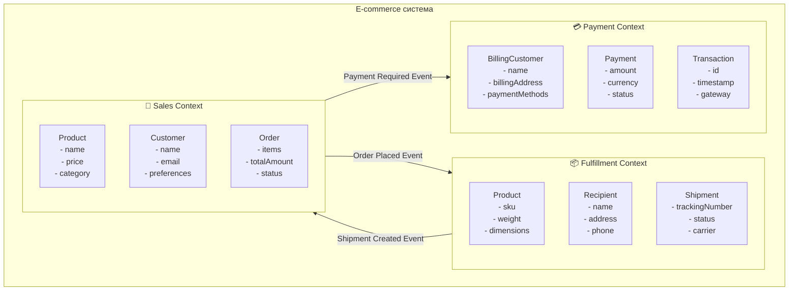

---
# === Основная информация ===
title: "Ограниченный контекст (Bounded Context)"
description: "Ограниченный контекст — это явная граница, внутри которой конкретная доменная модель определяется и применяется. Это центральный паттерн в стратегическом дизайне DDD."

# === Таксономия и Навигация ===
section: "ddd"
category: "strategic"

# === Визуал ===
cover: "/images/ddd/bounded-context-cover.svg"

# === Связи ===
related:
  - "context-map"
  - "ubiquitous-language"
  - "what-is-ddd"
  - "aggregate"

# === Метаданные ===
published: true
lastUpdated: "2024-05-21"
---

# Ограниченный контекст (Bounded Context)

### 🤕 Проблема

По мере роста системы одни и те же термины начинают означать разные вещи в разных частях приложения. Например, "Пользователь" в системе аутентификации — это логин и пароль, в системе биллинга — это клиент с платежными данными, а в системе доставки — это получатель с адресом.

Попытки создать единую модель "Пользователя" для всей системы приводят к появлению божественных объектов (God Objects) с десятками полей и методов, большинство из которых не имеют смысла в конкретном контексте. Код становится сложным для понимания, тестирования и изменения.

### 💡 Решение

Ограниченный контекст (Bounded Context) — это явная граница, внутри которой конкретная доменная модель определяется и применяется. Внутри границы все термины имеют четкое, однозначное значение и составляют единый язык (Ubiquitous Language) этого контекста.

Ключевые принципы:

1. **Четкие границы**: Каждый контекст имеет явно определенные границы
2. **Единый язык внутри**: В пределах контекста все термины имеют одно значение
3. **Автономность**: Контекст может развиваться независимо от других
4. **Явная интеграция**: Взаимодействие между контекстами происходит через определенные интерфейсы

### 🏗️ Структура



### 👨‍💻 Пример в коде

#### Sales Context (Контекст продаж)
```typescript
// В контексте продаж Customer - это покупатель с предпочтениями
export class Customer {
  constructor(
    private readonly customerId: CustomerId,
    private readonly email: Email,
    private readonly preferences: ShoppingPreferences
  ) {}
  
  public createOrder(items: ProductItem[]): Order {
    return new Order(this.customerId, items, new Date());
  }
  
  public applyDiscount(order: Order): Order {
    return this.preferences.applyLoyaltyDiscount(order);
  }
}

// Product в контексте продаж - это товар с ценой и описанием
export class Product {
  constructor(
    private readonly productId: ProductId,
    private readonly name: string,
    private readonly price: Money,
    private readonly category: Category
  ) {}
  
  public isAvailableForPurchase(): boolean {
    return this.category.isActive() && this.price.isPositive();
  }
}
```

#### Fulfillment Context (Контекст выполнения заказов)
```typescript
// В контексте выполнения Customer - это получатель товара
export class Recipient {
  constructor(
    private readonly recipientId: RecipientId,
    private readonly name: string,
    private readonly shippingAddress: Address,
    private readonly contactPhone: PhoneNumber
  ) {}
  
  public canReceiveShipment(): boolean {
    return this.shippingAddress.isDeliverable() && 
           this.contactPhone.isValid();
  }
}

// Product в контексте выполнения - это товар с физическими характеристиками
export class Product {
  constructor(
    private readonly sku: SKU,
    private readonly weight: Weight,
    private readonly dimensions: Dimensions,
    private readonly fragility: FragilityLevel
  ) {}
  
  public calculateShippingCost(destination: Address): Money {
    return this.weight.calculateCost(destination) +
           this.fragility.getHandlingFee();
  }
}

export class Shipment {
  constructor(
    private readonly shipmentId: ShipmentId,
    private readonly products: Product[],
    private readonly recipient: Recipient
  ) {}
  
  public ship(carrier: Carrier): TrackingNumber {
    const packageWeight = this.calculateTotalWeight();
    return carrier.createShipment(this.recipient.shippingAddress, packageWeight);
  }
}
```

### 🎯 Как определить границы контекста

#### 1. Анализ языка предметной области
Обратите внимание на термины, которые имеют разные значения:
- "Пользователь" в аутентификации ≠ "Клиент" в биллинге
- "Продукт" в каталоге ≠ "Товар" на складе
- "Заказ" в продажах ≠ "Поставка" в логистике

#### 2. Организационные границы
Часто контексты соответствуют организационной структуре:
- Отдел продаж → Sales Context
- Служба доставки → Fulfillment Context  
- Финансовый отдел → Accounting Context

#### 3. Источники данных
Разные контексты часто работают с разными источниками данных:
- CRM система → Customer Management Context
- ERP система → Inventory Context
- Payment Gateway → Payment Context

### 🔄 Взаимодействие между контекстами

#### Синхронная интеграция
```typescript
// Anti-Corruption Layer для защиты от внешних изменений
export class PaymentContextAdapter {
  constructor(private paymentService: ExternalPaymentService) {}
  
  public processPayment(order: SalesOrder): PaymentResult {
    const paymentRequest = this.translateToPaymentContext(order);
    const externalResult = this.paymentService.charge(paymentRequest);
    return this.translateToSalesContext(externalResult);
  }
  
  private translateToPaymentContext(order: SalesOrder): PaymentRequest {
    return new PaymentRequest(
      order.customerId.value,
      order.totalAmount.amount,
      order.totalAmount.currency
    );
  }
}
```

#### Асинхронная интеграция через события
```typescript
// Domain Event для связи между контекстами
export class OrderPlacedEvent implements DomainEvent {
  constructor(
    public readonly orderId: string,
    public readonly customerId: string,
    public readonly items: OrderItem[],
    public readonly totalAmount: number,
    public readonly occurredAt: Date
  ) {}
}

// Handler в Fulfillment Context
export class OrderPlacedEventHandler {
  public async handle(event: OrderPlacedEvent): Promise<void> {
    // Переводим данные в терминологию Fulfillment Context
    const recipient = await this.recipientRepository.findByCustomerId(
      new CustomerId(event.customerId)
    );
    
    const shipment = new Shipment(
      ShipmentId.generate(),
      this.translateOrderItems(event.items),
      recipient
    );
    
    await this.shipmentRepository.save(shipment);
  }
}
```

### ✅ Признаки хорошо определенных границ

- **Единый язык**: Внутри контекста все термины имеют четкое значение
- **Автономность команды**: Команда может работать независимо в своем контексте
- **Минимальные зависимости**: Контекст имеет минимум внешних зависимостей
- **Четкие интерфейсы**: Взаимодействие с другими контекстами происходит через явные API
- **Связанные данные**: Данные внутри контекста часто изменяются вместе

### 🚨 Антипаттерны

#### 1. Размытые границы
```typescript
// Плохо: класс знает о деталях других контекстов
class Order {
  public ship(): void {
    // Логика доставки в контексте продаж - нарушение границ!
    const carrier = new FedExCarrier();
    const trackingNumber = carrier.ship(this.address);
    this.trackingNumber = trackingNumber;
  }
}
```

#### 2. Божественные модели
```typescript
// Плохо: один класс User для всех контекстов
class User {
  // Данные для аутентификации
  public username: string;
  public password: string;
  
  // Данные для биллинга  
  public creditCard: CreditCard;
  public billingAddress: Address;
  
  // Данные для доставки
  public shippingAddresses: Address[];
  public phoneNumber: string;
  
  // Методы для всех контекстов - нарушение принципа единственной ответственности
  public authenticate(): boolean { ... }
  public chargeCreditCard(amount: Money): void { ... }
  public ship(order: Order): void { ... }
}
```

### 👍 Плюсы и 👎 Минусы

| Плюсы | Минусы |
|-------|--------|
| Упрощает понимание и разработку внутри контекста | Увеличивает сложность интеграции между контекстами |
| Позволяет командам работать независимо | Может привести к дублированию кода и данных |
| Снижает связанность между подсистемами | Требует дополнительных усилий на проектирование границ |
| Облегчает тестирование отдельных частей системы | Усложняет сквозные операции, затрагивающие несколько контекстов |
| Поддерживает различные технологические стеки в разных контекстах | Может создать проблемы с консистентностью данных |

### 🎯 Практические рекомендации

1. **Начинайте с больших контекстов** и разделяйте их по мере необходимости
2. **Выделяйте контексты по бизнес-возможностям** (business capabilities), а не по техническим слоям
3. **Документируйте границы явно** — создавайте Context Map диаграммы
4. **Используйте события для связи** между контекстами вместо прямых вызовов
5. **Применяйте Anti-Corruption Layer** для защиты от внешних изменений
6. **Регулярно пересматривайте границы** — они должны развиваться вместе с пониманием домена

Помните: ограниченный контекст — это не просто техническая граница, это граница ответственности и понимания предметной области.