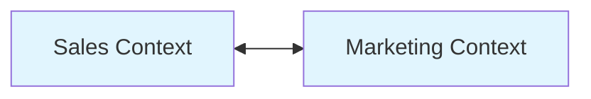
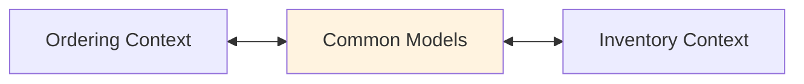
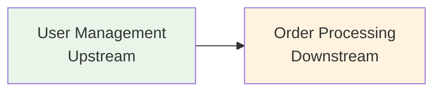
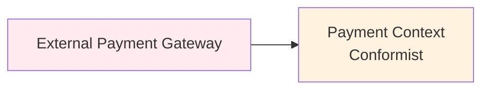
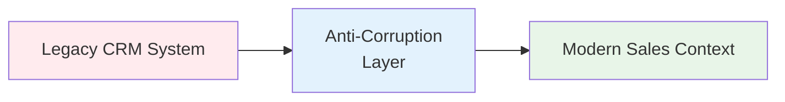
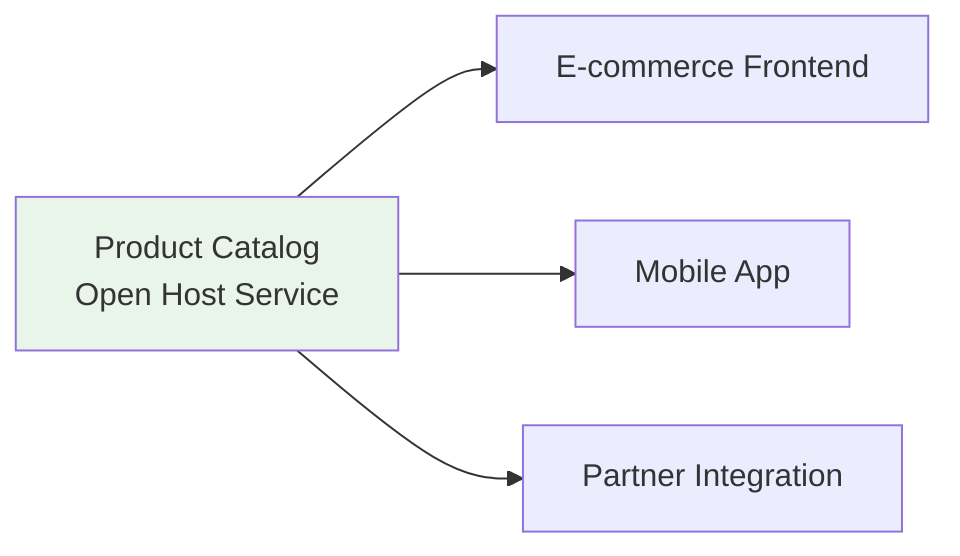
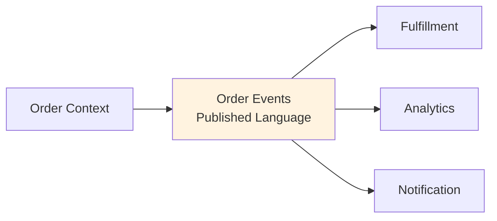
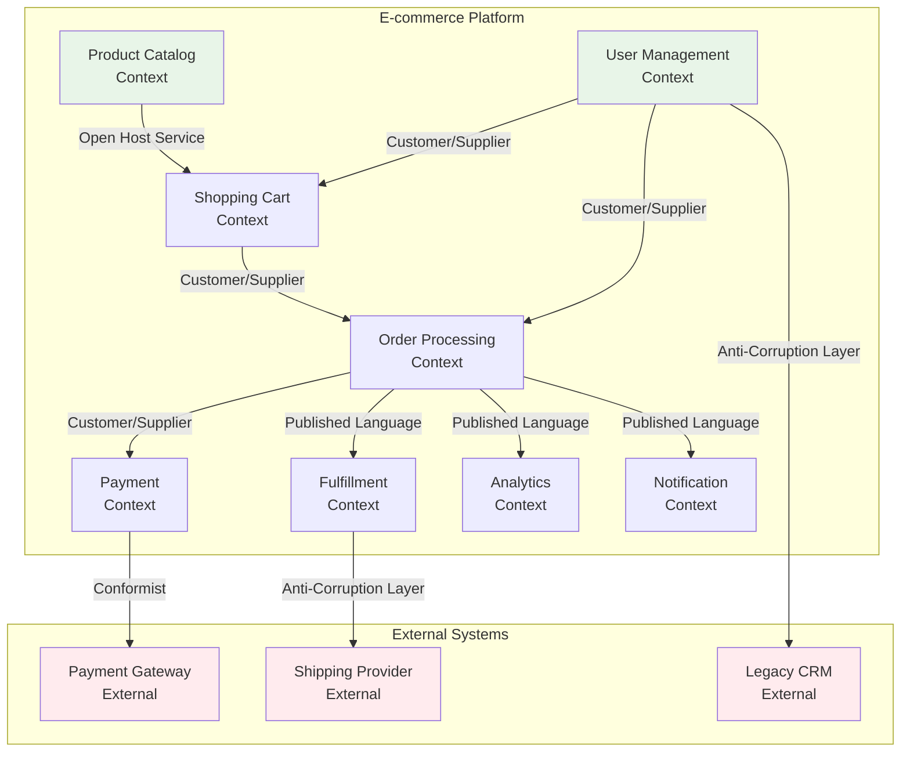

---
# === Основная информация ===
title: "Карта контекстов (Context Map)"
description: "Карта контекстов — это диаграмма высокого уровня, которая показает ограниченные контексты в системе и взаимоотношения между ними. Это ключевой инструмент стратегического проектирования в DDD."

# === Таксономия и Навигация ===
section: "ddd"
category: "strategic"

# === Визуал ===
cover: "/images/ddd/context-map-cover.svg"

# === Связи ===
related:
  - "bounded-context"
  - "ubiquitous-language"
  - "what-is-ddd"
  - "aggregate"

# === Метаданные ===
published: true
lastUpdated: "2024-05-21"
---

# Карта контекстов (Context Map)

### 🤕 Проблема

По мере роста системы количество ограниченных контекстов увеличивается, и становится сложно понять, как они взаимодействуют друг с другом. Разработчики теряются в сложных зависимостях, не понимают, какие контексты влияют друг на друга, и какие паттерны интеграции использовать.

Без четкого понимания взаимоотношений между контекстами возникают проблемы:
- Дублирование интеграционной логики
- Нарушение границ контекстов
- Сложности в планировании изменений
- Конфликты между командами
- Техническая задолженность в интеграционных точках

### 💡 Решение

Карта контекстов (Context Map) — это диаграмма высокого уровня, которая визуализирует все ограниченные контексты в системе и явно показывает взаимоотношения между ними. Она помогает командам понять:

- Какие контексты существуют в системе
- Как они взаимодействуют друг с другом
- Какие паттерны интеграции использовать
- Кто за что отвечает
- Где находятся точки синхронизации

### 🗺️ Типы взаимоотношений между контекстами

#### 1. Partnership (Партнерство)
Два контекста развиваются совместно, команды тесно координируют свои усилия.



**Пример**: Sales Context и Marketing Context совместно работают над системой лидов.

```typescript
// Общие модели и события для обоих контекстов
interface Lead {
  id: string;
  email: string;
  source: MarketingSource;
  score: LeadScore;
}

class LeadQualifiedEvent {
  constructor(
    public readonly leadId: string,
    public readonly salesRep: string,
    public readonly qualificationDate: Date
  ) {}
}
```

#### 2. Shared Kernel (Общее ядро)
Два контекста совместно используют часть модели. Изменения требуют согласования.



**Пример**: Общие модели Product и Money для контекстов заказов и инвентаря.

```typescript
// Shared Kernel - общие модели
export class Money {
  constructor(
    public readonly amount: number,
    public readonly currency: string
  ) {}
  
  public add(other: Money): Money {
    if (this.currency !== other.currency) {
      throw new Error('Cannot add different currencies');
    }
    return new Money(this.amount + other.amount, this.currency);
  }
}

export class ProductId {
  constructor(public readonly value: string) {}
}

// Использование в Ordering Context
class OrderItem {
  constructor(
    private productId: ProductId,  // Из Shared Kernel
    private price: Money          // Из Shared Kernel
  ) {}
}
```

#### 3. Customer/Supplier (Клиент/Поставщик)
Upstream контекст предоставляет сервисы Downstream контексту.



**Пример**: User Management предоставляет данные о пользователях для Order Processing.

```typescript
// Upstream: User Management Context
export class UserProfileService {
  public async getUserProfile(userId: string): Promise<UserProfile> {
    return await this.userRepository.findById(new UserId(userId));
  }
}

// Downstream: Order Processing Context
export class OrderService {
  constructor(
    private userProfileService: UserProfileService  // Зависимость от Upstream
  ) {}
  
  public async createOrder(userId: string, items: OrderItem[]): Promise<Order> {
    const userProfile = await this.userProfileService.getUserProfile(userId);
    
    // Переводим в терминологию нашего контекста
    const customer = new Customer(
      new CustomerId(userProfile.id),
      userProfile.email,
      userProfile.preferences
    );
    
    return new Order(customer, items);
  }
}
```

#### 4. Conformist (Конформист)
Downstream контекст принимает модель Upstream без изменений.



**Пример**: Интеграция с внешней платежной системой.

```typescript
// Внешняя модель (от третьей стороны)
interface ExternalPaymentResponse {
  transaction_id: string;
  status: 'success' | 'failed' | 'pending';
  amount_cents: number;
  currency_code: string;
}

// Конформист - используем модель как есть
export class PaymentService {
  public async processPayment(request: PaymentRequest): Promise<ExternalPaymentResponse> {
    // Используем внешнюю модель напрямую, без трансляции
    return await this.externalGateway.charge({
      amount: request.amount * 100,  // Конвертация в центы
      currency: request.currency,
      card_token: request.cardToken
    });
  }
}
```

#### 5. Anti-Corruption Layer (Антикоррупционный слой)
Downstream контекст защищает себя от изменений в Upstream через слой трансляции.



**Пример**: Интеграция с устаревшей CRM системой.

```typescript
// Устаревшая внешняя модель
interface LegacyCustomerData {
  cust_id: number;
  cust_name: string;
  cust_email: string;
  cust_status: 'A' | 'I' | 'S';  // Active, Inactive, Suspended
  created_dt: string;           // "YYYY-MM-DD HH:mm:ss"
}

// Anti-Corruption Layer
export class CustomerAdapter {
  public translateFromLegacy(legacyData: LegacyCustomerData): Customer {
    return new Customer(
      new CustomerId(legacyData.cust_id.toString()),
      new Email(legacyData.cust_email),
      legacyData.cust_name,
      this.translateStatus(legacyData.cust_status),
      new Date(legacyData.created_dt)
    );
  }
  
  private translateStatus(legacyStatus: string): CustomerStatus {
    switch (legacyStatus) {
      case 'A': return CustomerStatus.Active;
      case 'I': return CustomerStatus.Inactive;
      case 'S': return CustomerStatus.Suspended;
      default: throw new Error(`Unknown legacy status: ${legacyStatus}`);
    }
  }
  
  public translateToLegacy(customer: Customer): LegacyCustomerData {
    return {
      cust_id: parseInt(customer.id.value),
      cust_name: customer.name,
      cust_email: customer.email.value,
      cust_status: this.translateStatusToLegacy(customer.status),
      created_dt: customer.createdAt.toISOString().slice(0, 19).replace('T', ' ')
    };
  }
}
```

#### 6. Open Host Service (Открытый сервис)
Контекст предоставляет публичный API для множества клиентов.



**Пример**: Product Catalog API для различных клиентов.

```typescript
// Open Host Service - публичный API
export class ProductCatalogApi {
  @Get('/api/products/:id')
  public async getProduct(@Param('id') productId: string): Promise<ProductDto> {
    const product = await this.productService.findById(new ProductId(productId));
    return this.toDto(product);
  }
  
  @Get('/api/products')
  public async searchProducts(@Query() filters: ProductFilters): Promise<ProductDto[]> {
    const products = await this.productService.search(filters);
    return products.map(p => this.toDto(p));
  }
  
  // Стабильный DTO для внешних клиентов
  private toDto(product: Product): ProductDto {
    return {
      id: product.id.value,
      name: product.name,
      description: product.description,
      price: {
        amount: product.price.amount,
        currency: product.price.currency
      },
      availability: product.isAvailable(),
      category: product.category.name
    };
  }
}
```

#### 7. Published Language (Опубликованный язык)
Стандартизированная модель данных для интеграции между контекстами.



**Пример**: Стандартизированные события заказов.

```typescript
// Published Language - стандартные события
export class OrderPlacedEvent {
  public readonly eventType = 'OrderPlaced';
  public readonly version = '1.0';
  
  constructor(
    public readonly orderId: string,
    public readonly customerId: string,
    public readonly items: Array<{
      productId: string;
      quantity: number;
      unitPrice: {
        amount: number;
        currency: string;
      };
    }>,
    public readonly totalAmount: {
      amount: number;
      currency: string;
    },
    public readonly orderDate: string,  // ISO 8601 format
    public readonly shippingAddress: {
      street: string;
      city: string;
      country: string;
      postalCode: string;
    }
  ) {}
}

// Различные контексты потребляют стандартизированные события
export class FulfillmentEventHandler {
  public async handleOrderPlaced(event: OrderPlacedEvent): Promise<void> {
    // Все контексты понимают единый формат событий
    const shipment = new Shipment(
      event.orderId,
      event.items,
      event.shippingAddress
    );
    
    await this.shipmentService.createShipment(shipment);
  }
}
```

### 🎯 Создание Context Map

#### 1. Определите все контексты
Начните с инвентаризации всех ограниченных контекстов в вашей системе.

#### 2. Выявите взаимодействия
Определите, какие контексты взаимодействуют и как именно.

#### 3. Классифицируйте отношения
Для каждого взаимодействия определите подходящий паттерн.

#### 4. Документируйте решения
Создайте диаграмму и опишите каждое взаимодействие.

### 📊 Пример полной Context Map



### ✅ Признаки хорошей Context Map

- **Полнота**: Показывает все важные контексты и их взаимодействия
- **Актуальность**: Регулярно обновляется при изменении системы
- **Понятность**: Легко читается всеми участниками команды
- **Практичность**: Используется для принятия архитектурных решений
- **Детализация**: Содержит достаточно деталей для понимания интеграций

### 👍 Плюсы и 👎 Минусы

| Плюсы | Минусы |
|-------|--------|
| Обеспечивает общее понимание архитектуры системы | Требует постоянного обновления |
| Помогает планировать изменения и их влияние | Может стать сложной для больших систем |
| Выявляет проблемы в интеграциях | Требует времени на создание и поддержание |
| Улучшает коммуникацию между командами | Может быть слишком абстрактной для разработчиков |
| Помогает избежать архитектурных антипаттернов | Не заменяет детальную техническую документацию |

### 🎯 Практические рекомендации

1. **Начинайте просто**: Создайте базовую диаграмму и дополняйте ее постепенно
2. **Вовлекайте всех**: Context Map должна создаваться совместно всеми командами
3. **Обновляйте регулярно**: Пересматривайте карту при каждом значимом изменении архитектуры
4. **Используйте для планирования**: Анализируйте влияние изменений через Context Map
5. **Документируйте решения**: Объясняйте, почему выбран конкретный паттерн взаимодействия
6. **Автоматизируйте где возможно**: Используйте инструменты для автоматической генерации диаграмм

Context Map — это не просто диаграмма, это инструмент стратегического планирования и коммуникации, который помогает командам принимать обоснованные архитектурные решения.