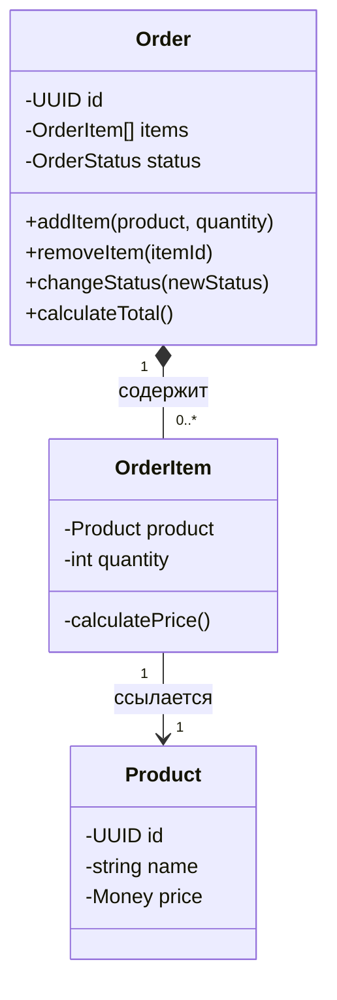

---
# === Основная информация ===
title: "Агрегат" # H1 страницы и название в навигации
description: "Агрегат — это кластер доменных объектов, который можно рассматривать как единое целое. Он гарантирует целостность бизнес-правил внутри своей границы." # Короткое описание для превью-карточек и SEO

# === Таксономия и Навигация ===
section: "ddd" # Главный раздел (ddd, smells, clean-architecture)
category: "tactical" # Подкатегория (strategic, tactical, etc.)

# === Визуал ===
cover: "/images/patterns/aggregate-cover.svg" # Путь к главной иллюстрации

# === Связи (Секретный Соус) ===
related:
  - "entity"
  - "value-object"
  - "repository"
  - "anemic-model" # Ссылка на "запах", который этот паттерн лечит

# === Метаданные ===
published: true # true/false. Позволяет держать черновики в репозитории
lastUpdated: "2024-05-21"
---

# Агрегат

### 🤕 Проблема

Работая со сложной бизнес-логикой, мы часто сталкиваемся с группами взаимосвязанных объектов, которые должны изменяться согласованно. Например, при обновлении заказа необходимо учитывать влияние на все его позиции, проверять лимиты, обновлять итоговую сумму и множество других взаимосвязанных операций. Эти проверки и обновления часто оказываются разбросаны по разным службам, что приводит к несогласованности данных, нарушению бизнес-правил и сложностям с поддержкой кода.

### 💡 Решение

Агрегат — это группа связанных объектов, которые обрабатываются как единое целое с точки зрения изменения данных. У каждого агрегата есть корень (root) и граница. Корень агрегата — это единственная сущность, через которую внешний код может взаимодействовать с внутренними объектами агрегата. Корень гарантирует целостность всех объектов в пределах границы агрегата.

### ⚙️ Структура



### 👨‍💻 Пример в коде

```typescript
// Корень Агрегата - единственный публичный вход
export class Order extends AggregateRoot {
  private _id: OrderId;
  private _items: OrderItem[];
  private _status: OrderStatus;
  private _customerId: CustomerId;

  constructor(id: OrderId, customerId: CustomerId) {
    super();
    this._id = id;
    this._customerId = customerId;
    this._items = [];
    this._status = OrderStatus.Draft;
  }

  public addItem(product: Product, quantity: number): void {
    if (this._status !== OrderStatus.Draft) {
      throw new Error("Can only add items to a draft order.");
    }
    
    if (quantity <= 0) {
      throw new Error("Quantity must be positive");
    }
    
    // Проверяем, есть ли уже такой товар в заказе
    const existingItem = this._items.find(item => item.productId.equals(product.id));
    
    if (existingItem) {
      existingItem.increaseQuantity(quantity);
    } else {
      const newItem = new OrderItem(
        new OrderItemId(uuidv4()), 
        this._id, 
        product.id, 
        quantity, 
        product.price
      );
      this._items.push(newItem);
    }
    
    // Добавляем доменное событие
    this.addDomainEvent(new OrderItemAddedEvent(this._id, product.id, quantity));
  }

  public removeItem(orderItemId: OrderItemId): void {
    if (this._status !== OrderStatus.Draft) {
      throw new Error("Can only remove items from a draft order.");
    }

    const itemIndex = this._items.findIndex(item => item.id.equals(orderItemId));
    
    if (itemIndex === -1) {
      throw new Error("Item not found in order");
    }
    
    const removedItem = this._items[itemIndex];
    this._items.splice(itemIndex, 1);
    
    this.addDomainEvent(new OrderItemRemovedEvent(this._id, removedItem.productId));
  }

  public submitOrder(): void {
    if (this._status !== OrderStatus.Draft) {
      throw new Error("Can only submit draft orders");
    }
    
    if (this._items.length === 0) {
      throw new Error("Cannot submit an empty order");
    }
    
    this._status = OrderStatus.Submitted;
    this.addDomainEvent(new OrderSubmittedEvent(this._id, this._customerId));
  }

  public calculateTotal(): Money {
    return this._items.reduce(
      (total, item) => total.add(item.price.multiply(item.quantity)),
      new Money(0)
    );
  }

  // Геттеры для доступа к внутренним данным
  get id(): OrderId { return this._id; }
  get items(): ReadonlyArray<OrderItem> { return Object.freeze([...this._items]); }
  get status(): OrderStatus { return this._status; }
  get customerId(): CustomerId { return this._customerId; }
}

// Внутренний объект агрегата Order
class OrderItem {
  private readonly _id: OrderItemId;
  private readonly _orderId: OrderId;
  private readonly _productId: ProductId;
  private _quantity: number;
  private readonly _unitPrice: Money;

  constructor(
    id: OrderItemId,
    orderId: OrderId,
    productId: ProductId,
    quantity: number,
    unitPrice: Money
  ) {
    this._id = id;
    this._orderId = orderId;
    this._productId = productId;
    this._quantity = quantity;
    this._unitPrice = unitPrice;
  }

  public increaseQuantity(quantity: number): void {
    if (quantity <= 0) {
      throw new Error("Quantity must be positive");
    }
    this._quantity += quantity;
  }

  public decreaseQuantity(quantity: number): void {
    if (quantity <= 0) {
      throw new Error("Quantity must be positive");
    }
    
    if (this._quantity - quantity < 0) {
      throw new Error("Cannot decrease quantity below zero");
    }
    
    this._quantity -= quantity;
  }

  get id(): OrderItemId { return this._id; }
  get orderId(): OrderId { return this._orderId; }
  get productId(): ProductId { return this._productId; }
  get quantity(): number { return this._quantity; }
  get unitPrice(): Money { return this._unitPrice; }
  get price(): Money { return this._unitPrice.multiply(this._quantity); }
}
```

### ✅ Когда применять (Чек-лист)

- Когда у вас есть группа объектов, которые должны изменяться согласованно
- Когда нужно защитить инварианты (бизнес-правила), которые охватывают несколько объектов
- Когда требуется транзакционная целостность для группы объектов
- Когда нужно упростить модель доменной области, рассматривая сложную взаимосвязанную структуру как единое целое
- Когда необходимо контролировать доступ к группе объектов через единую точку входа

### 👍 Плюсы и 👎 Минусы

| Плюсы | Минусы |
|-------|--------|
| Гарантирует целостность данных и соблюдение бизнес-правил | Может привести к раздутым объектам, если границы определены неправильно |
| Упрощает транзакционную логику | Требует внимательного проектирования границ агрегатов |
| Защищает инварианты домена | Слишком крупные агрегаты могут негативно влиять на производительность |
| Повышает уровень инкапсуляции | Увеличивает сложность работы с объектами, если интерфейс корня не продуман |
| Делает доменную модель более понятной | Требует глубокого понимания предметной области |