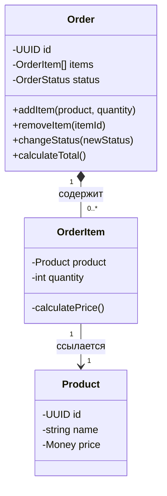

---
# === Основная информация ===
title: "Агрегат" # H1 страницы и название в навигации
description: "Агрегат — это кластер доменных объектов, который можно рассматривать как единое целое. Он гарантирует целостность бизнес-правил внутри своей границы." # Короткое описание для превью-карточек и SEO

# === Таксономия и Навигация ===
section: "ddd" # Главный раздел (ddd, smells, clean-architecture)
category: "tactical" # Подкатегория (strategic, tactical, etc.)

# === Визуал ===
cover: "/images/patterns/aggregate-cover.svg" # Путь к главной иллюстрации

# === Связи (Секретный Соус) ===
related:
  - "entity"
  - "value-object"
  - "repository"
  - "anemic-model" # Ссылка на "запах", который этот паттерн лечит

# === Метаданные ===
published: true # true/false. Позволяет держать черновики в репозитории
lastUpdated: "2024-05-21"
---

# Агрегат

### 🤕 Проблема

Работая со сложной бизнес-логикой, мы часто сталкиваемся с группами взаимосвязанных объектов, которые должны изменяться согласованно. Например, при обновлении заказа необходимо учитывать влияние на все его позиции, проверять лимиты, обновлять итоговую сумму и множество других взаимосвязанных операций. Эти проверки и обновления часто оказываются разбросаны по разным службам, что приводит к несогласованности данных, нарушению бизнес-правил и сложностям с поддержкой кода.

### 💡 Решение

Агрегат — это группа связанных объектов, которые обрабатываются как единое целое с точки зрения изменения данных. У каждого агрегата есть корень (root) и граница. Корень агрегата — это единственная сущность, через которую внешний код может взаимодействовать с внутренними объектами агрегата. Корень гарантирует целостность всех объектов в пределах границы агрегата.

### ⚙️ Структура

```mermaid
classDiagram
    class Order {
        -UUID id
        -OrderItem[] items
        -OrderStatus status
        +addItem(product, quantity)
        +removeItem(itemId)
        +changeStatus(newStatus)
        +calculateTotal()
    }

    class OrderItem {
        -Product product
        -int quantity
        -calculatePrice()
    }

    class Product {
        -UUID id
        -string name
        -Money price
    }

    Order "1" *-- "0..*" OrderItem : содержит
    OrderItem "1" --> "1" Product : ссылается
```

### 👨‍💻 Пример в коде

import CodeExample from '../../../components/CodeExample.astro';
import AnnotatedCode from '../../../components/AnnotatedCode.astro';

<CodeExample
  title="Пример агрегата Order"
  description="Выберите уровень детализации примера, который вам интересен."
  basicCode={`
// Корень Агрегата - основная часть
class Order {
  private items = [];
  private status = OrderStatus.Draft;
  
  public addItem(product, quantity) {
    if (this.status !== OrderStatus.Draft) {
      throw new Error("Can only add items to a draft order");
    }
    
    this.items.push(new OrderItem(product, quantity));
  }
}
`}
  advancedCode={`
// Корень Агрегата с бизнес-правилами
class Order {
  private items = [];
  private status = OrderStatus.Draft;
  private customerId;
  
  constructor(customerId) {
    this.customerId = customerId;
  }
  
  public addItem(product, quantity) {
    if (this.status !== OrderStatus.Draft) {
      throw new Error("Can only add items to a draft order");
    }
    
    if (quantity <= 0) {
      throw new Error("Quantity must be positive");
    }
    
    const existingItem = this.items.find(item => 
      item.productId === product.id);
    
    if (existingItem) {
      existingItem.increaseQuantity(quantity);
    } else {
      this.items.push(new OrderItem(product, quantity));
    }
  }
  
  public submitOrder() {
    if (this.status !== OrderStatus.Draft) {
      throw new Error("Can only submit draft orders");
    }
    
    if (this.items.length === 0) {
      throw new Error("Cannot submit an empty order");
    }
    
    this.status = OrderStatus.Submitted;
  }
}
`}
  fullCode={`
// Корень Агрегата - единственный публичный вход
export class Order extends AggregateRoot {
  private _id: OrderId;
  private _items: OrderItem[];
  private _status: OrderStatus;
  private _customerId: CustomerId;

  constructor(id: OrderId, customerId: CustomerId) {
    super();
    this._id = id;
    this._customerId = customerId;
    this._items = [];
    this._status = OrderStatus.Draft;
  }

  public addItem(product: Product, quantity: number): void {
    if (this._status !== OrderStatus.Draft) {
      throw new Error("Can only add items to a draft order.");
    }
    
    if (quantity <= 0) {
      throw new Error("Quantity must be positive");
    }
    
    // Проверяем, есть ли уже такой товар в заказе
    const existingItem = this._items.find(item => item.productId.equals(product.id));
    
    if (existingItem) {
      existingItem.increaseQuantity(quantity);
    } else {
      const newItem = new OrderItem(
        new OrderItemId(uuidv4()), 
        this._id, 
        product.id, 
        quantity, 
        product.price
      );
      this._items.push(newItem);
    }
    
    // Добавляем доменное событие
    this.addDomainEvent(new OrderItemAddedEvent(this._id, product.id, quantity));
  }

  public removeItem(orderItemId: OrderItemId): void {
    if (this._status !== OrderStatus.Draft) {
      throw new Error("Can only remove items from a draft order.");
    }

    const itemIndex = this._items.findIndex(item => item.id.equals(orderItemId));
    
    if (itemIndex === -1) {
      throw new Error("Item not found in order");
    }
    
    const removedItem = this._items[itemIndex];
    this._items.splice(itemIndex, 1);
    
    this.addDomainEvent(new OrderItemRemovedEvent(this._id, removedItem.productId));
  }

  public submitOrder(): void {
    if (this._status !== OrderStatus.Draft) {
      throw new Error("Can only submit draft orders");
    }
    
    if (this._items.length === 0) {
      throw new Error("Cannot submit an empty order");
    }
    
    this._status = OrderStatus.Submitted;
    this.addDomainEvent(new OrderSubmittedEvent(this._id, this._customerId));
  }

  public calculateTotal(): Money {
    return this._items.reduce(
      (total, item) => total.add(item.price.multiply(item.quantity)),
      new Money(0)
    );
  }

  // Геттеры для доступа к внутренним данным
  get id(): OrderId { return this._id; }
  get items(): ReadonlyArray<OrderItem> { return Object.freeze([...this._items]); }
  get status(): OrderStatus { return this._status; }
  get customerId(): CustomerId { return this._customerId; }
}
`}
/>

<h3>Детализация внутреннего класса OrderItem</h3>

<AnnotatedCode
  code={`class OrderItem {
  private readonly productId;
  private quantity;
  private readonly unitPrice;

  constructor(product, quantity, unitPrice) {
    this.productId = product.id;
    this.quantity = quantity;
    this.unitPrice = unitPrice;
  }

  public increaseQuantity(quantity) {
    if (quantity <= 0) {
      throw new Error("Quantity must be positive");
    }
    this.quantity += quantity;
  }
  
  get price() {
    return this.unitPrice.multiply(this.quantity);
  }
}`}
  annotations={[
    { 
      line: 1, 
      text: "OrderItem - это внутренний объект агрегата Order. Он не имеет смысла вне контекста заказа." 
    },
    { 
      line: 6, 
      text: "Конструктор принимает продукт, количество и цену. Заметьте, что мы храним только ID продукта, а не весь объект." 
    },
    { 
      line: 12, 
      text: "Метод увеличения количества включает бизнес-правило: количество должно быть положительным." 
    },
    { 
      line: 18, 
      text: "Вычисляемое свойство price инкапсулирует логику расчета цены позиции заказа." 
    }
  ]}
/>

### ✅ Когда применять (Чек-лист)

- Когда у вас есть группа объектов, которые должны изменяться согласованно
- Когда нужно защитить инварианты (бизнес-правила), которые охватывают несколько объектов
- Когда требуется транзакционная целостность для группы объектов
- Когда нужно упростить модель доменной области, рассматривая сложную взаимосвязанную структуру как единое целое
- Когда необходимо контролировать доступ к группе объектов через единую точку входа

### 👍 Плюсы и 👎 Минусы

| Плюсы | Минусы |
|-------|--------|
| Гарантирует целостность данных и соблюдение бизнес-правил | Может привести к раздутым объектам, если границы определены неправильно |
| Упрощает транзакционную логику | Требует внимательного проектирования границ агрегатов |
| Защищает инварианты домена | Слишком крупные агрегаты могут негативно влиять на производительность |
| Повышает уровень инкапсуляции | Увеличивает сложность работы с объектами, если интерфейс корня не продуман |
| Делает доменную модель более понятной | Требует глубокого понимания предметной области |

import ResourceLinks from '../../../components/ResourceLinks.astro';

<ResourceLinks
  resources={[
    {
      title: "Domain-Driven Design: Tackling Complexity in the Heart of Software",
      url: "https://www.amazon.com/Domain-Driven-Design-Tackling-Complexity-Software/dp/0321125215",
      description: "Классическая книга Эрика Эванса, впервые представившая концепцию агрегатов",
      type: "book"
    },
    {
      title: "Effective Aggregate Design",
      url: "https://vaughnvernon.co/?p=838",
      description: "Серия статей Вона Вернона о проектировании агрегатов",
      type: "article"
    },
    {
      title: "Implementing Domain-Driven Design",
      url: "https://www.amazon.com/Implementing-Domain-Driven-Design-Vaughn-Vernon/dp/0321834577",
      description: "Практическое руководство по внедрению DDD от Вона Вернона",
      type: "book"
    },
    {
      title: "DDD и архитектура микросервисов",
      url: "https://www.youtube.com/watch?v=dQw4w9WgXcQ",
      description: "Доклад о связи DDD, агрегатов и микросервисной архитектуры",
      type: "video"
    }
  ]}
/>