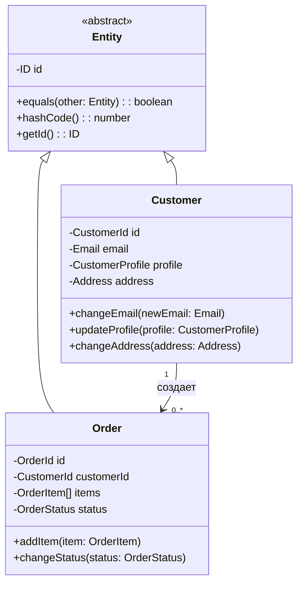

---
# === Основная информация ===
title: "Сущность (Entity)"
description: "Сущность — это объект, который имеет уникальную идентичность, которая остается неизменной на протяжении всего жизненного цикла объекта. Сущности отличаются друг от друга по своей идентичности, а не по атрибутам."

# === Таксономия и Навигация ===
section: "ddd"
category: "tactical"

# === Визуал ===
cover: "/images/patterns/entity-cover.svg"

# === Связи ===
related:
  - "value-object"
  - "aggregate"
  - "repository"
  - "anemic-model"

# === Метаданные ===
published: true
lastUpdated: "2024-05-21"
---

# Сущность (Entity)

### 🤕 Проблема

При моделировании предметной области мы часто работаем с объектами, которые должны оставаться "теми же самыми" объектами на протяжении времени, несмотря на изменения их атрибутов. Например, пользователь может поменять email, имя, адрес, но он все равно остается тем же пользователем. Заказ может изменить статус, добавить товары, но это все тот же заказ.

Без четкого понимания идентичности возникают проблемы:
- Как отличить один объект от другого?
- Как отследить изменения объекта во времени?
- Как корректно сравнивать объекты в разных частях системы?
- Как обеспечить целостность данных при обновлениях?

Попытки сравнивать объекты по всем их атрибутам приводят к ошибкам: два разных пользователя могут временно иметь одинаковые имена, но это не делает их одним человеком.

### 💡 Решение

Сущность (Entity) — это объект предметной области, который определяется уникальной идентичностью, а не набором атрибутов. Главная характеристика сущности — это способность отслеживать свою идентичность на протяжении всего жизненного цикла, даже когда ее атрибуты изменяются.

Ключевые принципы сущностей:

1. **Уникальная идентичность**: каждая сущность имеет уникальный идентификатор
2. **Непрерывность**: идентичность сохраняется на протяжении всего жизненного цикла
3. **Изменяемость**: атрибуты могут изменяться, но идентичность остается той же
4. **Сравнение по идентичности**: две сущности равны, если равны их идентификаторы

### ⚙️ Структура



### 👨‍💻 Пример в коде

import CodeExample from '../../../components/CodeExample.astro';
import AnnotatedCode from '../../../components/AnnotatedCode.astro';
import ResourceLinks from '../../../components/ResourceLinks.astro';

<CodeExample
  title="Создание базового класса сущности"
  description="Выберите уровень детализации для понимания концепции сущности."
  basicCode={`
// Простая сущность с идентичностью
class Customer {
  private readonly id: string;
  private email: string;
  private name: string;
  
  constructor(id: string, email: string, name: string) {
    this.id = id;
    this.email = email;
    this.name = name;
  }
  
  public equals(other: Customer): boolean {
    return this.id === other.id;
  }
  
  public getId(): string {
    return this.id;
  }
}
`}
  advancedCode={`
// Типизированные идентификаторы для безопасности
class CustomerId {
  constructor(private readonly value: string) {
    if (!value) throw new Error('ID cannot be empty');
  }
  
  public equals(other: CustomerId): boolean {
    return this.value === other.value;
  }
  
  public getValue(): string {
    return this.value;
  }
}

class Customer extends Entity<CustomerId> {
  private email: Email;
  private profile: CustomerProfile;
  
  constructor(id: CustomerId, email: Email, profile: CustomerProfile) {
    super(id);
    this.email = email;
    this.profile = profile;
  }
  
  public changeEmail(newEmail: Email): void {
    this.email = newEmail;
  }
}
`}
  fullCode={`
// Полная реализация с бизнес-логикой
export abstract class Entity<TId> {
  protected readonly _id: TId;

  protected constructor(id: TId) {
    this._id = id;
  }

  public equals(other: Entity<TId>): boolean {
    if (!other || this.constructor !== other.constructor) {
      return false;
    }
    return this._id === other._id;
  }

  public get id(): TId {
    return this._id;
  }
}

export class CustomerId {
  constructor(private readonly _value: string) {
    if (!_value?.trim()) {
      throw new Error('Customer ID cannot be empty');
    }
  }

  public static generate(): CustomerId {
    return new CustomerId(crypto.randomUUID());
  }

  public equals(other: CustomerId): boolean {
    return other !== null && this._value === other._value;
  }

  public get value(): string {
    return this._value;
  }
}

export class Customer extends Entity<CustomerId> {
  private _email: Email;
  private _profile: CustomerProfile;
  private _isActive: boolean;

  constructor(id: CustomerId, email: Email, profile: CustomerProfile) {
    super(id);
    this._email = email;
    this._profile = profile;
    this._isActive = true;
  }

  public static create(email: Email, profile: CustomerProfile): Customer {
    return new Customer(CustomerId.generate(), email, profile);
  }

  public changeEmail(newEmail: Email): void {
    if (!newEmail) throw new Error('Email cannot be null');
    this._email = newEmail;
  }

  public deactivate(): void {
    this._isActive = false;
  }

  public canPlaceOrder(): boolean {
    return this._isActive && this._profile.isVerified;
  }

  // Геттеры
  get email(): Email { return this._email; }
  get profile(): CustomerProfile { return this._profile; }
  get isActive(): boolean { return this._isActive; }
}
`}
/>

<AnnotatedCode
  code={`export abstract class Entity<TId> {
  protected readonly _id: TId;

  protected constructor(id: TId) {
    this._id = id;
  }

  public equals(other: Entity<TId>): boolean {
    if (other === null || other === undefined) {
      return false;
    }
    
    if (this === other) {
      return true;
    }
    
    if (this.constructor !== other.constructor) {
      return false;
    }
    
    return this._id === other._id;
  }

  public get id(): TId {
    return this._id;
  }
}`}
  annotations={[
    { 
      line: 2, 
      text: "ID защищен от изменения - это основа идентичности сущности. После создания ID никогда не должен меняться." 
    },
    { 
      line: 4, 
      text: "Конструктор protected - сущности должны создаваться через специализированные фабричные методы." 
    },
    { 
      line: 8, 
      text: "Сравнение сущностей ВСЕГДА происходит по ID, а не по атрибутам. Это ключевое отличие от объектов-значений." 
    },
    { 
      line: 17, 
      text: "Проверяем тип класса - сущности разных типов не могут быть равны, даже если у них одинаковые ID." 
    }
  ]}
/>

### Детализация идентификаторов сущностей

<CodeExample
  title="Сущность Customer с бизнес-логикой"
  description="Пример того, как сущность инкапсулирует состояние и поведение."
  basicCode={`
class Customer extends Entity<CustomerId> {
  private _email: Email;
  private _isActive: boolean;

  constructor(id: CustomerId, email: Email) {
    super(id);
    this._email = email;
    this._isActive = true;
  }

  public changeEmail(newEmail: Email): void {
    if (!newEmail) {
      throw new Error('Email cannot be null');
    }
    this._email = newEmail;
  }

  public deactivate(): void {
    this._isActive = false;
  }

  // Бизнес-правило
  public canPlaceOrder(): boolean {
    return this._isActive;
  }
}
`}
  advancedCode={`
export class Customer extends Entity<CustomerId> {
  private _email: Email;
  private _profile: CustomerProfile;
  private _address: Address;
  private _isActive: boolean;

  constructor(id: CustomerId, email: Email, profile: CustomerProfile, address: Address) {
    super(id);
    this._email = email;
    this._profile = profile;
    this._address = address;
    this._isActive = true;
  }

  public static create(email: Email, profile: CustomerProfile, address: Address): Customer {
    const id = CustomerId.generate();
    return new Customer(id, email, profile, address);
  }

  public changeEmail(newEmail: Email): void {
    if (!newEmail) throw new Error('Email cannot be null');
    
    if (this._email.equals(newEmail)) return; // Нет изменений
    
    this._email = newEmail;
    // Генерируем доменное событие
    this.addDomainEvent(new CustomerEmailChangedEvent(this.id, newEmail));
  }

  public updateProfile(newProfile: CustomerProfile): void {
    if (!newProfile) throw new Error('Profile cannot be null');
    this._profile = newProfile;
  }

  public canPlaceOrder(): boolean {
    return this._isActive && this._profile.isVerified;
  }

  // Геттеры
  get email(): Email { return this._email; }
  get isActive(): boolean { return this._isActive; }
}
`}
  fullCode={`
export class Customer extends Entity<CustomerId> {
  private _email: Email;
  private _profile: CustomerProfile;
  private _address: Address;
  private _registrationDate: Date;
  private _isActive: boolean;

  constructor(id: CustomerId, email: Email, profile: CustomerProfile, address: Address) {
    super(id);
    this._email = email;
    this._profile = profile;
    this._address = address;
    this._registrationDate = new Date();
    this._isActive = true;
  }

  public static create(email: Email, profile: CustomerProfile, address: Address): Customer {
    const id = CustomerId.generate();
    return new Customer(id, email, profile, address);
  }

  public changeEmail(newEmail: Email): void {
    if (!newEmail) throw new Error('Email cannot be null');
    if (this._email.equals(newEmail)) return;
    
    this._email = newEmail;
    this.addDomainEvent(new CustomerEmailChangedEvent(this.id, newEmail));
  }

  public updateProfile(newProfile: CustomerProfile): void {
    if (!newProfile) throw new Error('Profile cannot be null');
    this._profile = newProfile;
  }

  public changeAddress(newAddress: Address): void {
    if (!newAddress) throw new Error('Address cannot be null');
    this._address = newAddress;
  }

  public deactivate(): void {
    this._isActive = false;
    this.addDomainEvent(new CustomerDeactivatedEvent(this.id));
  }

  public reactivate(): void {
    this._isActive = true;
    this.addDomainEvent(new CustomerReactivatedEvent(this.id));
  }

  // Бизнес-правила
  public canPlaceOrder(): boolean {
    return this._isActive && this._profile.isVerified;
  }

  public getAccountAge(): number {
    return Date.now() - this._registrationDate.getTime();
  }

  // Геттеры для доступа к состоянию
  get email(): Email { return this._email; }
  get profile(): CustomerProfile { return this._profile; }
  get address(): Address { return this._address; }
  get registrationDate(): Date { return new Date(this._registrationDate.getTime()); }
  get isActive(): boolean { return this._isActive; }
}
`}
/>

<AnnotatedCode
  code={`export class Order extends Entity<OrderId> {
  private _customerId: CustomerId;
  private _items: OrderItem[];
  private _status: OrderStatus;

  constructor(id: OrderId, customerId: CustomerId, items: OrderItem[]) {
    super(id);
    this._customerId = customerId;
    this._items = [...items];
    this._status = OrderStatus.Draft;
  }

  public confirm(): void {
    if (this._status !== OrderStatus.Draft) {
      throw new Error('Only draft orders can be confirmed');
    }
    
    if (this._items.length === 0) {
      throw new Error('Cannot confirm empty order');
    }
    
    this._status = OrderStatus.Confirmed;
  }

  public addItem(item: OrderItem): void {
    if (this._status !== OrderStatus.Draft) {
      throw new Error('Can only add items to draft orders');
    }
    
    const existingItem = this._items.find(i => 
      i.productId.equals(item.productId)
    );
    
    if (existingItem) {
      existingItem.increaseQuantity(item.quantity);
    } else {
      this._items.push(item);
    }
  }

  public canBeModified(): boolean {
    return this._status === OrderStatus.Draft;
  }
}`}
  annotations={[
    { 
      line: 1, 
      text: "Order наследует от Entity<OrderId> - это означает, что заказы сравниваются по ID, а не по содержимому." 
    },
    { 
      line: 9, 
      text: "Создаем копию массива items - это защищает внутреннее состояние от внешних изменений." 
    },
    { 
      line: 14, 
      text: "Бизнес-правило: подтвердить можно только черновик заказа. Это инкапсулированная логика предметной области." 
    },
    { 
      line: 25, 
      text: "Проверяем статус перед изменением - сущность защищает свои инварианты от нарушения." 
    },
    { 
      line: 29, 
      text: "Умная логика добавления товаров - если товар уже есть, увеличиваем количество вместо дублирования." 
    }
  ]}
/>

### 🆚 Сущности vs Объекты-значения

Ключевое различие между сущностями и объектами-значениями:

```typescript
// СУЩНОСТЬ - сравнивается по идентичности
const customer1 = new Customer(
  new CustomerId('123'), 
  new Email('john@example.com'),
  profile,
  address
);

const customer2 = new Customer(
  new CustomerId('123'), 
  new Email('john.doe@example.com'), // Другой email!
  profile,
  address
);

console.log(customer1.equals(customer2)); // true - тот же ID!

// ОБЪЕКТ-ЗНАЧЕНИЕ - сравнивается по значению
const money1 = new Money(100, 'USD');
const money2 = new Money(100, 'USD');
const money3 = new Money(200, 'USD');

console.log(money1.equals(money2)); // true - одинаковые значения
console.log(money1.equals(money3)); // false - разные значения
```

### 💾 Работа с хранилищем

Сущности часто работают с репозиториями:

```typescript
// Интерфейс репозитория для сущности Customer
export interface CustomerRepository {
  findById(id: CustomerId): Promise<Customer | null>;
  findByEmail(email: Email): Promise<Customer | null>;
  save(customer: Customer): Promise<void>;
  delete(id: CustomerId): Promise<void>;
}

// Использование в сервисе
export class CustomerService {
  constructor(private customerRepository: CustomerRepository) {}

  public async updateCustomerEmail(
    customerId: CustomerId, 
    newEmail: Email
  ): Promise<void> {
    // 1. Найти сущность по ID
    const customer = await this.customerRepository.findById(customerId);
    if (!customer) {
      throw new Error('Customer not found');
    }

    // 2. Проверить бизнес-правила
    const existingCustomer = await this.customerRepository.findByEmail(newEmail);
    if (existingCustomer && !existingCustomer.id.equals(customerId)) {
      throw new Error('Email already in use');
    }

    // 3. Выполнить бизнес-операцию
    customer.changeEmail(newEmail);

    // 4. Сохранить изменения
    await this.customerRepository.save(customer);
  }
}
```

### ✅ Признаки правильно спроектированной сущности

- **Четкая идентичность**: у сущности есть уникальный, неизменяемый идентификатор
- **Бизнес-методы**: сущность содержит поведение, а не только данные
- **Инкапсуляция**: состояние защищено от прямого изменения извне
- **Инварианты**: сущность всегда находится в валидном состоянии
- **Осмысленные операции**: методы отражают реальные бизнес-операции

### 🚨 Антипаттерны

#### 1. Сущность без поведения (анемичная модель)
```typescript
// Плохо - просто контейнер данных
class Customer {
  public id: string;
  public email: string;
  public name: string;
  
  // Только геттеры и сеттеры, нет бизнес-логики
}
```

#### 2. Сравнение по атрибутам вместо идентичности
```typescript
// Плохо - сравнение сущностей по атрибутам
public equals(other: Customer): boolean {
  return this.email === other.email && 
         this.name === other.name;
}
```

#### 3. Изменяемый идентификатор
```typescript
// Плохо - идентификатор можно изменить
class Customer {
  public id: string; // Публичное изменяемое поле!
  
  public setId(newId: string) { // Метод для смены ID!
    this.id = newId;
  }
}
```

### 👍 Плюсы и 👎 Минусы

| Плюсы | Минусы |
|-------|--------|
| Четкое отслеживание объектов во времени | Требует продуманного проектирования идентификаторов |
| Инкапсуляция бизнес-правил и поведения | Может усложнить сериализацию и маппинг |
| Упрощение работы с базой данных | Необходимость управления жизненным циклом |
| Естественное моделирование предметной области | Потенциальные проблемы с производительностью при большом количестве сущностей |
| Поддержка транзакционной целостности | Сложность в определении границ сущности |

### 🎯 Практические рекомендации

1. **Используйте типизированные идентификаторы**: `CustomerId` вместо `string`
2. **Защищайте идентичность**: делайте ID неизменяемым после создания
3. **Инкапсулируйте состояние**: предоставляйте методы для изменения, а не прямой доступ
4. **Следуйте принципу единственной ответственности**: одна сущность — одна концепция домена
5. **Используйте фабричные методы**: для создания сущностей в валидном состоянии
6. **Добавляйте доменные события**: для уведомления о важных изменениях
7. **Тестируйте поведение**: проверяйте бизнес-правила, а не только геттеры/сеттеры

### 🔄 Связь с другими паттернами

- **[Агрегат](/ddd/tactical/aggregate)**: Сущности часто являются частью агрегатов или их корнями
- **[Объект-значение](/ddd/tactical/value-object)**: Сущности используют объекты-значения как атрибуты
- **[Репозиторий](/ddd/tactical/repository)**: Обеспечивает персистентность сущностей
- **[Доменные события](/ddd/tactical/domain-event)**: Сущности могут генерировать события при изменениях

<ResourceLinks
  resources={[
    {
      title: "Domain-Driven Design: Tackling Complexity",
      url: "https://www.amazon.com/Domain-Driven-Design-Tackling-Complexity-Software/dp/0321125215",
      description: "Классическая книга Эрика Эванса о DDD - глава 5 посвящена сущностям",
      type: "book"
    },
    {
      title: "Implementing Domain-Driven Design",
      url: "https://www.amazon.com/Implementing-Domain-Driven-Design-Vaughn-Vernon/dp/0321834577",
      description: "Практическое руководство по DDD от Вона Вернона",
      type: "book"
    },
    {
      title: "DDD and Microservices: At Last, Some Boundaries!",
      url: "https://www.infoq.com/presentations/ddd-microservices-2016/",
      description: "Доклад о связи DDD и микросервисов",
      type: "talk"
    },
    {
      title: "Entity vs Value Object: The ultimate list of differences",
      url: "https://enterprisecraftsmanship.com/posts/entity-vs-value-object-the-ultimate-list-of-differences/",
      description: "Подробное сравнение сущностей и объектов-значений",
      type: "article"
    },
    {
      title: "DDD Sample Application",
      url: "https://github.com/citerus/dddsample-core",
      description: "Эталонная реализация приложения с использованием DDD",
      type: "repo"
    }
  ]}
/>

Помните: сущность — это не просто объект с ID. Это объект с идентичностью, поведением и жизненным циклом, который моделирует важную концепцию вашей предметной области.