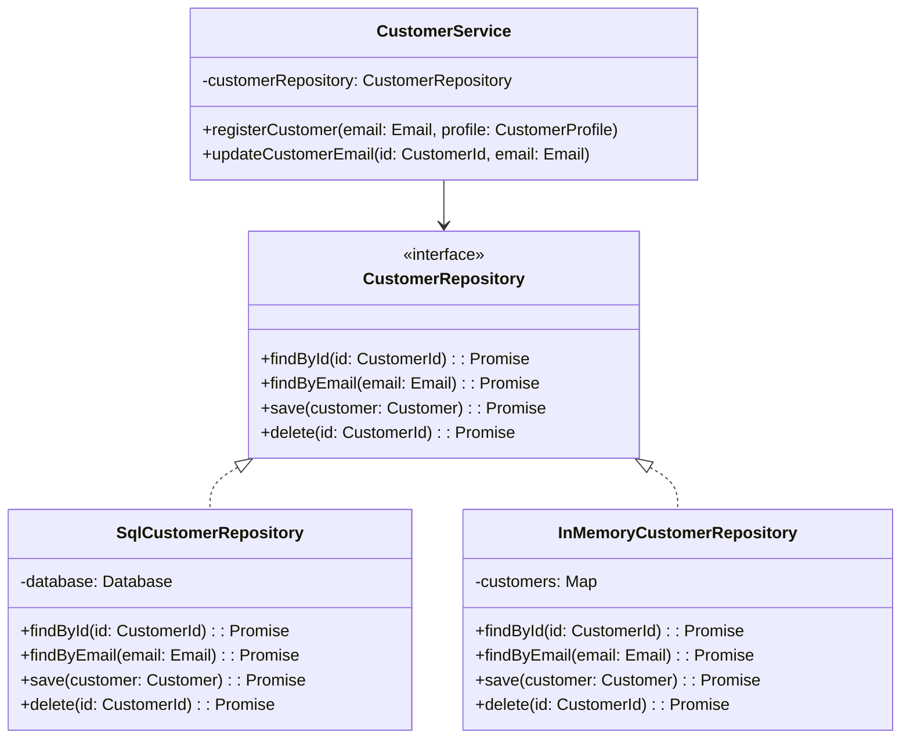

---
# === Основная информация ===
title: "Репозиторий (Repository)"
description: "Репозиторий — это паттерн, который инкапсулирует логику доступа к данным и предоставляет более объектно-ориентированный взгляд на слой персистентности. Он действует как коллекция объектов в памяти."

# === Таксономия и Навигация ===
section: "ddd"
category: "tactical"

# === Визуал ===
cover: "/images/patterns/repository-cover.svg"

# === Связи ===
related:
  - "aggregate"
  - "entity"
  - "value-object"
  - "anemic-model"

# === Метаданные ===
published: true
lastUpdated: "2024-05-21"
---

# Репозиторий (Repository)

### 🤕 Проблема

При работе с доменной моделью мы сталкиваемся с необходимостью сохранять и загружать сущности из различных источников данных: баз данных, файлов, внешних API. Без правильной абстракции доменная логика становится сильно связанной с технологиями хранения данных.

Типичные проблемы:
- **Смешивание бизнес-логики с кодом доступа к данным** — SQL-запросы в бизнес-сервисах
- **Сложность тестирования** — невозможно протестировать бизнес-логику без базы данных
- **Нарушение принципа инверсии зависимостей** — высокоуровневые модули зависят от низкоуровневых
- **Дублирование кода доступа к данным** — одинаковые запросы в разных местах
- **Сложность смены технологии хранения** — изменение БД затрагивает всю систему

Представьте сервис, который напрямую работает с базой данных:

```typescript
// Плохо - бизнес-логика смешана с доступом к данным
class OrderService {
  constructor(private database: Database) {}
  
  async processOrder(customerId: string, items: any[]): Promise<void> {
    // SQL прямо в бизнес-логике!
    const customerRow = await this.database.query(
      'SELECT * FROM customers WHERE id = ?', 
      [customerId]
    );
    
    if (!customerRow || !customerRow.is_active) {
      throw new Error('Customer not found or inactive');
    }
    
    // Больше SQL...
    const orderId = await this.database.query(
      'INSERT INTO orders (customer_id, status) VALUES (?, ?)',
      [customerId, 'pending']
    );
    
    // Еще больше SQL...
    for (const item of items) {
      await this.database.query(
        'INSERT INTO order_items (order_id, product_id, quantity) VALUES (?, ?, ?)',
        [orderId, item.productId, item.quantity]
      );
    }
  }
}
```

### 💡 Решение

Репозиторий (Repository) — это паттерн, который предоставляет интерфейс для доступа к коллекции доменных объектов, скрывая детали их физического хранения. Он действует как слой абстракции между доменной моделью и инфраструктурой данных.

Ключевые принципы репозитория:

1. **Коллекционная семантика**: Репозиторий ведет себя как коллекция объектов в памяти
2. **Доменная ориентированность**: Методы выражены в терминах предметной области
3. **Инкапсуляция**: Скрывает детали технологии хранения данных
4. **Инверсия зависимостей**: Доменная модель определяет интерфейс репозитория
5. **Единственная ответственность**: Отвечает только за операции с одним типом агрегата

### ⚙️ Структура



### 👨‍💻 Пример в коде

import CodeExample from '../../../components/CodeExample.astro';
import AnnotatedCode from '../../../components/AnnotatedCode.astro';
import ResourceLinks from '../../../components/ResourceLinks.astro';

<CodeExample
  title="Определение интерфейса репозитория"
  description="Выберите уровень детализации для понимания паттерна Repository."
  basicCode={`
// Простой интерфейс репозитория
interface CustomerRepository {
  findById(id: string): Promise<Customer | null>;
  findByEmail(email: string): Promise<Customer | null>;
  save(customer: Customer): Promise<void>;
  delete(id: string): Promise<void>;
}

// Использование в сервисе
class CustomerService {
  constructor(private customerRepo: CustomerRepository) {}
  
  async updateEmail(id: string, newEmail: string): Promise<void> {
    const customer = await this.customerRepo.findById(id);
    if (!customer) throw new Error('Customer not found');
    
    customer.changeEmail(newEmail);
    await this.customerRepo.save(customer);
  }
}
`}
  advancedCode={`
// Типизированный интерфейс с доменными методами
export interface CustomerRepository {
  findById(id: CustomerId): Promise<Customer | null>;
  findByEmail(email: Email): Promise<Customer | null>;
  save(customer: Customer): Promise<void>;
  delete(id: CustomerId): Promise<void>;
  
  // Доменно-специфичные запросы
  findActiveCustomersInRegion(region: string): Promise<Customer[]>;
  findCustomersByRegistrationDate(from: Date, to: Date): Promise<Customer[]>;
}

export class CustomerService {
  constructor(private customerRepository: CustomerRepository) {}

  async registerCustomer(email: Email, profile: CustomerProfile): Promise<CustomerId> {
    // Проверяем уникальность email
    const existing = await this.customerRepository.findByEmail(email);
    if (existing) throw new Error('Email already exists');
    
    // Создаем и сохраняем
    const customer = Customer.create(email, profile);
    await this.customerRepository.save(customer);
    
    return customer.id;
  }
}
`}
  fullCode={`
// Полный интерфейс с расширенными возможностями
export interface CustomerRepository {
  // Основные операции
  findById(id: CustomerId): Promise<Customer | null>;
  findByEmail(email: Email): Promise<Customer | null>;
  save(customer: Customer): Promise<void>;
  delete(id: CustomerId): Promise<void>;
  
  // Доменно-специфичные запросы
  findActiveCustomersInRegion(region: string): Promise<Customer[]>;
  findCustomersByRegistrationDate(from: Date, to: Date): Promise<Customer[]>;
  findCustomersWithOrdersAbove(amount: Money): Promise<Customer[]>;
  
  // Пагинация и сортировка
  findAll(page: number, limit: number): Promise<PaginatedResult<Customer>>;
  findBySpecification(spec: Specification<Customer>): Promise<Customer[]>;
}

export interface OrderRepository {
  findById(id: OrderId): Promise<Order | null>;
  findByCustomerId(customerId: CustomerId): Promise<Order[]>;
  findDraftOrdersByCustomer(customerId: CustomerId): Promise<Order[]>;
  save(order: Order): Promise<void>;
  delete(id: OrderId): Promise<void>;
  
  // Статистические запросы
  getTotalOrdersCount(): Promise<number>;
  getOrdersInDateRange(from: Date, to: Date): Promise<Order[]>;
}

// Использование в Application Service
export class OrderApplicationService {
  constructor(
    private orderRepository: OrderRepository,
    private customerRepository: CustomerRepository
  ) {}

  async placeOrder(command: PlaceOrderCommand): Promise<OrderResult> {
    const customer = await this.customerRepository.findById(command.customerId);
    if (!customer) throw new Error('Customer not found');
    
    if (!customer.canPlaceOrder()) {
      throw new Error('Customer cannot place orders');
    }
    
    const order = Order.create(command.customerId, command.items);
    await this.orderRepository.save(order);
    
    return new OrderResult(order.id);
  }
}
`}
/>

### Реализация SQL репозитория

<AnnotatedCode
  code={`export class SqlCustomerRepository implements CustomerRepository {
  constructor(private database: Database) {}

  async findById(id: CustomerId): Promise<Customer | null> {
    const row = await this.database.queryOne(
      'SELECT * FROM customers WHERE id = ?',
      [id.value]
    );
    
    if (!row) return null;
    return this.mapRowToCustomer(row);
  }

  async save(customer: Customer): Promise<void> {
    const exists = await this.findById(customer.id);
    
    if (exists) {
      await this.update(customer);
    } else {
      await this.insert(customer);
    }
  }

  private mapRowToCustomer(row: any): Customer {
    const customerId = new CustomerId(row.id);
    const email = new Email(row.email);
    const profile = new CustomerProfile(row.first_name, row.last_name);
    
    const customer = new Customer(customerId, email, profile);
    
    if (!row.is_active) {
      customer.deactivate();
    }
    
    return customer;
  }
}`}
  annotations={[
    { 
      line: 1, 
      text: "Реализация репозитория в инфраструктурном слое. Доменный слой знает только об интерфейсе." 
    },
    { 
      line: 9, 
      text: "Если данных нет в БД, возвращаем null вместо исключения - это часть бизнес-логики." 
    },
    { 
      line: 13, 
      text: "Паттерн 'Insert or Update' - репозиторий сам определяет, нужно создать или обновить запись." 
    },
    { 
      line: 22, 
      text: "Маппинг из БД в доменный объект - ответственность репозитория скрывать детали хранения." 
    },
    { 
      line: 28, 
      text: "Восстанавливаем состояние сущности из сохраненных данных - сущность должна быть в валидном состоянии." 
    }
  ]}
/>

### In-Memory реализация для тестов

<CodeExample
  title="In-Memory репозиторий для тестирования"
  description="Простая реализация в памяти позволяет легко тестировать бизнес-логику."
  basicCode={`
class InMemoryCustomerRepository implements CustomerRepository {
  private customers = new Map<string, Customer>();

  async findById(id: CustomerId): Promise<Customer | null> {
    return this.customers.get(id.value) || null;
  }

  async save(customer: Customer): Promise<void> {
    this.customers.set(customer.id.value, customer);
  }

  async delete(id: CustomerId): Promise<void> {
    this.customers.delete(id.value);
  }

  // Утилиты для тестов
  clear(): void {
    this.customers.clear();
  }
}
`}
  advancedCode={`
export class InMemoryCustomerRepository implements CustomerRepository {
  private customers = new Map<string, Customer>();

  async findById(id: CustomerId): Promise<Customer | null> {
    return this.customers.get(id.value) || null;
  }

  async findByEmail(email: Email): Promise<Customer | null> {
    for (const customer of this.customers.values()) {
      if (customer.email.equals(email)) {
        return customer;
      }
    }
    return null;
  }

  async save(customer: Customer): Promise<void> {
    // Создаем копию для имитации серизализации/десериализации
    const customerCopy = this.cloneCustomer(customer);
    this.customers.set(customer.id.value, customerCopy);
  }

  async findActiveCustomersInRegion(region: string): Promise<Customer[]> {
    const result: Customer[] = [];
    
    for (const customer of this.customers.values()) {
      if (customer.isActive && customer.address.region === region) {
        result.push(customer);
      }
    }
    
    return result;
  }

  // Методы для тестов
  clear(): void { this.customers.clear(); }
  size(): number { return this.customers.size; }
}
`}
  fullCode={`
export class InMemoryCustomerRepository implements CustomerRepository {
  private customers = new Map<string, Customer>();

  async findById(id: CustomerId): Promise<Customer | null> {
    return this.customers.get(id.value) || null;
  }

  async findByEmail(email: Email): Promise<Customer | null> {
    for (const customer of this.customers.values()) {
      if (customer.email.equals(email)) {
        return customer;
      }
    }
    return null;
  }

  async save(customer: Customer): Promise<void> {
    // Создаем глубокую копию для имитации серизализации/десериализации
    const customerCopy = this.cloneCustomer(customer);
    this.customers.set(customer.id.value, customerCopy);
  }

  async delete(id: CustomerId): Promise<void> {
    this.customers.delete(id.value);
  }

  async findActiveCustomersInRegion(region: string): Promise<Customer[]> {
    const result: Customer[] = [];
    
    for (const customer of this.customers.values()) {
      if (customer.isActive && customer.address.region === region) {
        result.push(customer);
      }
    }
    
    return result;
  }

  async findCustomersByRegistrationDate(from: Date, to: Date): Promise<Customer[]> {
    const result: Customer[] = [];
    
    for (const customer of this.customers.values()) {
      if (customer.registrationDate >= from && customer.registrationDate <= to) {
        result.push(customer);
      }
    }
    
    return result;
  }

  // Утилиты для тестов
  clear(): void {
    this.customers.clear();
  }

  size(): number {
    return this.customers.size;
  }

  getAllCustomers(): Customer[] {
    return Array.from(this.customers.values());
  }

  private cloneCustomer(customer: Customer): Customer {
    // Простое клонирование - в реальности может быть сложнее
    return new Customer(
      customer.id,
      customer.email,
      customer.profile,
      customer.address
    );
  }
}
`}
/>

### 🏗️ Использование в сервисах

```typescript
export class CustomerService {
  constructor(
    private customerRepository: CustomerRepository,
    private emailService: EmailService
  ) {}

  async registerNewCustomer(
    email: Email,
    profile: CustomerProfile,
    address: Address
  ): Promise<CustomerId> {
    // Проверяем, не существует ли уже клиент с таким email
    const existingCustomer = await this.customerRepository.findByEmail(email);
    if (existingCustomer) {
      throw new Error('Customer with this email already exists');
    }

    // Создаем нового клиента
    const customer = Customer.create(email, profile, address);

    // Сохраняем через репозиторий
    await this.customerRepository.save(customer);

    // Отправляем приветственное письмо
    await this.emailService.sendWelcomeEmail(customer.email, customer.profile.firstName);

    return customer.id;
  }

  async updateCustomerEmail(customerId: CustomerId, newEmail: Email): Promise<void> {
    // Загружаем клиента
    const customer = await this.customerRepository.findById(customerId);
    if (!customer) {
      throw new Error('Customer not found');
    }

    // Проверяем, не занят ли новый email
    const customerWithEmail = await this.customerRepository.findByEmail(newEmail);
    if (customerWithEmail && !customerWithEmail.id.equals(customerId)) {
      throw new Error('Email already in use');
    }

    // Выполняем бизнес-операцию
    customer.changeEmail(newEmail);

    // Сохраняем изменения
    await this.customerRepository.save(customer);
  }

  async getActiveCustomersInRegion(region: string): Promise<Customer[]> {
    return await this.customerRepository.findActiveCustomersInRegion(region);
  }
}
```

### 🧪 Тестирование с репозиториями

```typescript
describe('CustomerService', () => {
  let customerService: CustomerService;
  let customerRepository: InMemoryCustomerRepository;
  let emailService: jest.Mocked<EmailService>;

  beforeEach(() => {
    customerRepository = new InMemoryCustomerRepository();
    emailService = {
      sendWelcomeEmail: jest.fn()
    } as any;
    
    customerService = new CustomerService(customerRepository, emailService);
  });

  describe('registerNewCustomer', () => {
    it('should create and save new customer', async () => {
      // Arrange
      const email = new Email('john@example.com');
      const profile = new CustomerProfile('John', 'Doe');
      const address = new Address('123 Main St', 'NYC', '10001', 'USA');

      // Act
      const customerId = await customerService.registerNewCustomer(email, profile, address);

      // Assert
      expect(customerId).toBeDefined();
      
      const savedCustomer = await customerRepository.findById(customerId);
      expect(savedCustomer).toBeTruthy();
      expect(savedCustomer!.email.equals(email)).toBe(true);
      expect(emailService.sendWelcomeEmail).toHaveBeenCalledWith(email, 'John');
    });

    it('should throw error when email already exists', async () => {
      // Arrange
      const email = new Email('john@example.com');
      const existingCustomer = Customer.create(
        email,
        new CustomerProfile('Jane', 'Doe'),
        new Address('456 Oak St', 'LA', '90001', 'USA')
      );
      await customerRepository.save(existingCustomer);

      // Act & Assert
      await expect(
        customerService.registerNewCustomer(
          email,
          new CustomerProfile('John', 'Doe'),
          new Address('123 Main St', 'NYC', '10001', 'USA')
        )
      ).rejects.toThrow('Customer with this email already exists');
    });
  });
});
```

### 📐 Паттерны проектирования репозиториев

#### 1. Specification Pattern для сложных запросов

```typescript
// Спецификация для инкапсуляции критериев поиска
export interface Specification<T> {
  isSatisfiedBy(item: T): boolean;
  and(other: Specification<T>): Specification<T>;
  or(other: Specification<T>): Specification<T>;
}

export class ActiveCustomerSpecification implements Specification<Customer> {
  isSatisfiedBy(customer: Customer): boolean {
    return customer.isActive;
  }

  and(other: Specification<Customer>): Specification<Customer> {
    return new AndSpecification(this, other);
  }

  or(other: Specification<Customer>): Specification<Customer> {
    return new OrSpecification(this, other);
  }
}

export class CustomerInRegionSpecification implements Specification<Customer> {
  constructor(private region: string) {}

  isSatisfiedBy(customer: Customer): boolean {
    return customer.address.region === this.region;
  }
  
  // and() и or() методы...
}

// Обновленный интерфейс репозитория
export interface CustomerRepository {
  // ... существующие методы
  findBySpecification(spec: Specification<Customer>): Promise<Customer[]>;
}

// Использование
const activeInNYSpec = new ActiveCustomerSpecification()
  .and(new CustomerInRegionSpecification('NY'));

const customers = await customerRepository.findBySpecification(activeInNYSpec);
```

#### 2. Unit of Work для управления транзакциями

```typescript
export interface UnitOfWork {
  begin(): Promise<void>;
  commit(): Promise<void>;
  rollback(): Promise<void>;
  
  // Репозитории в рамках транзакции
  customers(): CustomerRepository;
  orders(): OrderRepository;
}

export class DatabaseUnitOfWork implements UnitOfWork {
  private transaction?: DatabaseTransaction;
  
  constructor(private database: Database) {}

  async begin(): Promise<void> {
    this.transaction = await this.database.beginTransaction();
  }

  async commit(): Promise<void> {
    if (this.transaction) {
      await this.transaction.commit();
      this.transaction = undefined;
    }
  }

  async rollback(): Promise<void> {
    if (this.transaction) {
      await this.transaction.rollback();
      this.transaction = undefined;
    }
  }

  customers(): CustomerRepository {
    return new SqlCustomerRepository(this.transaction || this.database);
  }

  orders(): OrderRepository {
    return new SqlOrderRepository(this.transaction || this.database);
  }
}
```

### ✅ Признаки хорошего репозитория

- **Коллекционная семантика**: методы похожи на работу с коллекцией в памяти
- **Доменная ориентированность**: названия методов отражают бизнес-операции
- **Один агрегат на репозиторий**: каждый репозиторий работает с одним типом корня агрегата
- **Скрытие технических деталей**: клиенты не знают о SQL, MongoDB, Redis и т.д.
- **Простота тестирования**: есть возможность создать in-memory реализацию

### 🚨 Антипаттерны

#### 1. Универсальный репозиторий

```typescript
// Плохо - универсальный репозиторий для всех сущностей
interface GenericRepository<T> {
  find(id: string): Promise<T>;
  save(entity: T): Promise<void>;
  delete(id: string): Promise<void>;
  findAll(): Promise<T[]>;
}
```

#### 2. Репозиторий как простая обертка над DAO

```typescript
// Плохо - просто передача SQL-запросов
class CustomerRepository {
  async findCustomersWithOrdersAboveAmount(amount: number): Promise<any[]> {
    return await this.database.query(
      'SELECT c.* FROM customers c JOIN orders o ON c.id = o.customer_id WHERE o.total > ?',
      [amount]
    );
  }
}
```

#### 3. Утечка деталей реализации

```typescript
// Плохо - возвращает объекты базы данных вместо доменных объектов
class CustomerRepository {
  async findById(id: string): Promise<CustomerDbRow> { // Database object!
    return await this.database.queryOne('SELECT * FROM customers WHERE id = ?', [id]);
  }
}
```

### 👍 Плюсы и 👎 Минусы

| Плюсы | Минусы |
|-------|--------|
| Разделение доменной логики и инфраструктуры | Увеличение количества интерфейсов и классов |
| Улучшение тестируемости через мок-реализации | Возможная избыточная абстракция для простых CRUD операций |
| Возможность легкой смены технологии хранения | Сложность при работе с cross-aggregate запросами |
| Инкапсуляция сложных запросов | Potential performance implications при неправильной реализации |
| Соблюдение принципов SOLID | Необходимость маппинга между доменными объектами и структурами данных |

### 🔄 Связь с другими паттернами

- **[Агрегат](/ddd/tactical/aggregate)**: Репозиторий работает с корнями агрегатов, а не с отдельными сущностями
- **[Сущность](/ddd/tactical/entity)**: Репозиторий сохраняет и восстанавливает сущности по их идентификаторам
- **[Объект-значение](/ddd/tactical/value-object)**: Объекты-значения сохраняются как часть сущностей
- **Unit of Work**: Координирует работу нескольких репозиториев в транзакции
- **Specification**: Инкапсулирует критерии поиска для сложных запросов

### 🎯 Практические рекомендации

1. **Один репозиторий на корень агрегата**: не создавайте репозитории для каждой сущности
2. **Используйте доменные термины**: `findActiveCustomersInRegion()` вместо `findByIsActiveTrueAndRegion()`
3. **Возвращайте доменные объекты**: никогда не возвращайте объекты базы данных напрямую
4. **Создавайте in-memory реализации для тестов**: это существенно упростит тестирование
5. **Не делайте универсальные репозитории**: каждый репозиторий должен быть специфичен для своего агрегата
6. **Инкапсулируйте сложные запросы**: вместо передачи SQL создавайте методы с говорящими именами
7. **Используйте async/await**: современная асинхронная модель упрощает код

<ResourceLinks
  resources={[
    {
      title: "Patterns of Enterprise Application Architecture",
      url: "https://www.amazon.com/Patterns-Enterprise-Application-Architecture-Martin/dp/0321127420",
      description: "Классическая книга Мартина Фаулера - оригинальное описание паттерна Repository",
      type: "book"
    },
    {
      title: "Domain-Driven Design: Tackling Complexity",
      url: "https://www.amazon.com/Domain-Driven-Design-Tackling-Complexity-Software/dp/0321125215",
      description: "Эрик Эванс о репозиториях в контексте DDD",
      type: "book"
    },
    {
      title: "Repository Pattern in DDD",
      url: "https://enterprisecraftsmanship.com/posts/repository-pattern-vs-dao/",
      description: "Детальное сравнение Repository и DAO паттернов",
      type: "article"
    },
    {
      title: "CQRS and Event Sourcing with Repository",
      url: "https://www.youtube.com/watch?v=dQw4w9WgXcQ",
      description: "Использование Repository в архитектуре CQRS",
      type: "video"
    },
    {
      title: "Specification Pattern Implementation",
      url: "https://github.com/dotnet-architecture/eShopOnContainers",
      description: "Пример реализации Specification pattern с Repository в .NET",
      type: "repo"
    },
    {
      title: "Testing with Repository Pattern",
      url: "https://martinfowler.com/articles/mocksArentStubs.html",
      description: "Мартин Фаулер о тестировании с использованием моков и стабов",
      type: "article"
    }
  ]}
/>

Репозиторий — это мост между вашей богатой доменной моделью и миром данных. Правильно спроектированный репозиторий делает доменную модель независимой от технологий хранения и значительно упрощает тестирование.