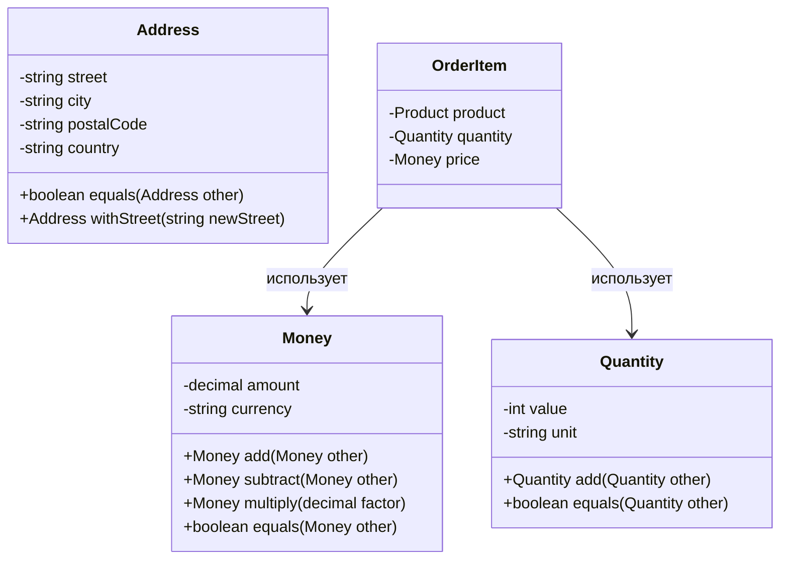

---
# === Основная информация ===
title: "Объект-значение" # H1 страницы и название в навигации
description: "Объект-значение — это объект, который представляет концептуальное целое и идентифицируется только по значению своих атрибутов. Используется для моделирования понятий, которые не имеют уникального идентификатора." # Короткое описание для превью-карточек и SEO

# === Таксономия и Навигация ===
section: "ddd" # Главный раздел (ddd, smells, clean-architecture)
category: "tactical" # Подкатегория (strategic, tactical, etc.)

# === Визуал ===
cover: "/images/patterns/value-object-cover.svg" # Путь к главной иллюстрации

# === Связи (Секретный Соус) ===
related:
  - "entity"
  - "aggregate"
  - "domain-event"
  - "god-object" # Ссылка на "запах", который этот паттерн лечит

# === Метаданные ===
published: true # true/false. Позволяет держать черновики в репозитории
lastUpdated: "2024-05-21"
---

# Объект-значение

### 🤕 Проблема

При моделировании предметной области мы часто сталкиваемся с концепциями, которые не имеют уникальной идентичности и могут быть взаимозаменяемы, если все их атрибуты одинаковы. Например, деньги, адреса, цвета, даты. Представление таких концепций как обычных объектов приводит к нарушению инкапсуляции, проблемам с изменяемостью и сложностям с сравнением объектов.

Как следствие, код становится менее понятным, появляются примитивные одержимости (primitive obsession), где бизнес-концепции представлены простыми типами данных, такими как строки или числа, и теряется смысловая нагрузка.

### 💡 Решение

Объект-значение (Value Object) — это объект, который представляет собой описательную характеристику чего-либо и не имеет уникальной идентичности. Он характеризуется следующими свойствами:

1. **Идентификация по значению**: Два объекта-значения равны, если все их атрибуты равны.
2. **Неизменяемость**: После создания объект-значение не может быть изменен.
3. **Отсутствие побочных эффектов**: Операции над объектами-значениями не меняют их состояние, а создают новые объекты.
4. **Концептуальная целостность**: Объект-значение представляет одно концептуальное целое.

### ⚙️ Структура

### 👨‍💻 Пример в коде

import CodeExample from '../../../components/CodeExample.astro';
import AnnotatedCode from '../../../components/AnnotatedCode.astro';
import ResourceLinks from '../../../components/ResourceLinks.astro';

<CodeExample
  title="Объект-значение Money"
  description="Выберите уровень детализации для понимания концепции объектов-значений."
  basicCode={`
// Простой объект-значение для денег
class Money {
  private readonly amount: number;
  private readonly currency: string;

  constructor(amount: number, currency: string) {
    this.amount = amount;
    this.currency = currency;
  }

  public add(other: Money): Money {
    if (this.currency !== other.currency) {
      throw new Error('Cannot add different currencies');
    }
    return new Money(this.amount + other.amount, this.currency);
  }

  public equals(other: Money): boolean {
    return this.amount === other.amount && 
           this.currency === other.currency;
  }
}

// Использование
const price1 = new Money(100, "USD");
const price2 = new Money(50, "USD");
const total = price1.add(price2); // Money(150, "USD")
`}
  advancedCode={`
// Расширенный объект-значение с валидацией
export class Money {
  private readonly _amount: number;
  private readonly _currency: string;

  constructor(amount: number, currency: string) {
    if (amount < 0) {
      throw new Error('Amount cannot be negative');
    }
    if (!currency || currency.length !== 3) {
      throw new Error('Currency must be 3-letter code');
    }
    
    this._amount = amount;
    this._currency = currency.toUpperCase();
  }

  public static zero(currency: string = 'USD'): Money {
    return new Money(0, currency);
  }

  public add(other: Money): Money {
    this.ensureSameCurrency(other);
    return new Money(this._amount + other._amount, this._currency);
  }

  public multiply(factor: number): Money {
    if (factor < 0) throw new Error('Factor cannot be negative');
    return new Money(this._amount * factor, this._currency);
  }

  public isGreaterThan(other: Money): boolean {
    this.ensureSameCurrency(other);
    return this._amount > other._amount;
  }

  private ensureSameCurrency(other: Money): void {
    if (this._currency !== other._currency) {
      throw new Error(\`Cannot operate on different currencies: \${this._currency} and \${other._currency}\`);
    }
  }

  get amount(): number { return this._amount; }
  get currency(): string { return this._currency; }
}
`}
  fullCode={`
// Полная реализация объекта-значения Money
export class Money {
  private readonly _amount: number;
  private readonly _currency: string;

  constructor(amount: number, currency: string) {
    if (amount < 0) {
      throw new Error('Amount cannot be negative');
    }
    if (!currency || currency.length !== 3) {
      throw new Error('Currency must be 3-letter ISO code');
    }
    
    this._amount = Math.round(amount * 100) / 100; // Округляем до 2 знаков
    this._currency = currency.toUpperCase();
  }

  public static zero(currency: string = 'USD'): Money {
    return new Money(0, currency);
  }

  public static fromCents(cents: number, currency: string): Money {
    return new Money(cents / 100, currency);
  }

  public add(other: Money): Money {
    this.ensureSameCurrency(other);
    return new Money(this._amount + other._amount, this._currency);
  }

  public subtract(other: Money): Money {
    this.ensureSameCurrency(other);
    const result = this._amount - other._amount;
    if (result < 0) {
      throw new Error('Subtraction would result in negative amount');
    }
    return new Money(result, this._currency);
  }

  public multiply(factor: number): Money {
    if (factor < 0) throw new Error('Factor cannot be negative');
    return new Money(this._amount * factor, this._currency);
  }

  public divide(divisor: number): Money {
    if (divisor <= 0) throw new Error('Divisor must be positive');
    return new Money(this._amount / divisor, this._currency);
  }

  public equals(other: Money): boolean {
    if (!other) return false;
    return this._amount === other._amount && this._currency === other._currency;
  }

  public isGreaterThan(other: Money): boolean {
    this.ensureSameCurrency(other);
    return this._amount > other._amount;
  }

  public isLessThan(other: Money): boolean {
    this.ensureSameCurrency(other);
    return this._amount < other._amount;
  }

  public isZero(): boolean {
    return this._amount === 0;
  }

  public toCents(): number {
    return Math.round(this._amount * 100);
  }

  private ensureSameCurrency(other: Money): void {
    if (this._currency !== other._currency) {
      throw new Error(\`Cannot operate on different currencies: \${this._currency} and \${other._currency}\`);
    }
  }

  get amount(): number { return this._amount; }
  get currency(): string { return this._currency; }

  public toString(): string {
    return \`\${this._amount.toFixed(2)} \${this._currency}\`;
  }

  public toJSON(): object {
    return {
      amount: this._amount,
      currency: this._currency
    };
  }
}
`}
/>

<AnnotatedCode
  code={`export class Address {
  private readonly _street: string;
  private readonly _city: string;
  private readonly _postalCode: string;
  private readonly _country: string;

  constructor(street: string, city: string, postalCode: string, country: string) {
    this.validateInputs(street, city, postalCode, country);
    
    this._street = street.trim();
    this._city = city.trim();
    this._postalCode = postalCode.trim();
    this._country = country.toUpperCase().trim();
  }

  public withStreet(newStreet: string): Address {
    return new Address(newStreet, this._city, this._postalCode, this._country);
  }

  public equals(other: Address): boolean {
    if (!other) return false;
    
    return this._street === other._street &&
           this._city === other._city &&
           this._postalCode === other._postalCode &&
           this._country === other._country;
  }

  private validateInputs(street: string, city: string, postalCode: string, country: string): void {
    if (!street?.trim()) throw new Error('Street is required');
    if (!city?.trim()) throw new Error('City is required');
    if (!postalCode?.trim()) throw new Error('Postal code is required');
    if (!country?.trim()) throw new Error('Country is required');
  }

  get street(): string { return this._street; }
  get city(): string { return this._city; }
  get postalCode(): string { return this._postalCode; }
  get country(): string { return this._country; }
}`}
  annotations={[
    { 
      line: 7, 
      text: "Валидация входных данных в конструкторе - объект-значение всегда должен быть в валидном состоянии." 
    },
    { 
      line: 9, 
      text: "Нормализация данных (trim, toUpperCase) обеспечивает консистентность при сравнении." 
    },
    { 
      line: 16, 
      text: "Метод withStreet() создает НОВЫЙ объект вместо изменения существующего - это неизменяемость." 
    },
    { 
      line: 23, 
      text: "Сравнение происходит по ВСЕМ атрибутам - это ключевое отличие от сущностей." 
    },
    { 
      line: 29, 
      text: "Приватная валидация инкапсулирует бизнес-правила внутри объекта-значения." 
    }
  ]}
/>

### 🆚 Сравнение объектов-значений с примитивами

<CodeExample
  title="Проблема примитивной одержимости и её решение"
  description="Видите разницу между использованием примитивов и объектов-значений?"
  basicCode={`
// ПЛОХО: примитивная одержимость
function calculateShippingCost(
  amount: number,        // Что это? Рубли? Доллары? Центы?
  currency: string,      // Может быть "USD", "usd", "Dollar"?
  weight: number,        // Граммы? Килограммы?
  fromAddress: string,   // Просто строка - может быть что угодно
  toAddress: string
): number {              // Возвращаем число - а в какой валюте?
  // Логика расчета...
  return 15.50;
}

// Использование - легко ошибиться
const cost = calculateShippingCost(
  100,                    // 100 чего?
  "usd",                  // Маленькими буквами
  1500,                   // 1.5 кг или 1500 грамм?
  "123 Main St, NY",      // Неструктурированный адрес
  "456 Oak Ave, LA"
);
`}
  advancedCode={`
// ХОРОШО: объекты-значения
function calculateShippingCost(
  price: Money,           // Четко понятно - деньги с валютой
  weight: Weight,         // Вес с единицами измерения
  fromAddress: Address,   // Структурированный адрес
  toAddress: Address
): Money {               // Возвращаем Money - с валютой!
  // Логика расчета...
  return new Money(15.50, price.currency);
}

// Использование - невозможно ошибиться
const cost = calculateShippingCost(
  new Money(100, "USD"),                    // Явно 100 долларов
  Weight.fromKilograms(1.5),               // Явно 1.5 кг
  new Address("123 Main St", "NY", "10001", "USA"),  // Структурированно
  new Address("456 Oak Ave", "LA", "90028", "USA")
);

// Компилятор не позволит передать неправильные типы!
// calculateShippingCost(100, ...) // ОШИБКА КОМПИЛЯЦИИ!
`}
  fullCode={`
// Полная реализация с валидацией и бизнес-логикой
class Weight {
  private readonly _value: number;
  private readonly _unit: WeightUnit;

  private constructor(value: number, unit: WeightUnit) {
    if (value < 0) throw new Error('Weight cannot be negative');
    this._value = value;
    this._unit = unit;
  }

  public static fromGrams(grams: number): Weight {
    return new Weight(grams, WeightUnit.Grams);
  }

  public static fromKilograms(kg: number): Weight {
    return new Weight(kg * 1000, WeightUnit.Grams); // Храним в граммах
  }

  public toKilograms(): number {
    return this._value / 1000;
  }

  public add(other: Weight): Weight {
    return new Weight(this._value + other._value, WeightUnit.Grams);
  }

  public isGreaterThan(other: Weight): boolean {
    return this._value > other._value;
  }
}

function calculateShippingCost(
  price: Money,
  weight: Weight,
  fromAddress: Address,
  toAddress: Address
): Money {
  // Бизнес-правила инкапсулированы в объектах-значениях
  if (price.isLessThan(Money.zero(price.currency))) {
    throw new Error('Price cannot be negative');
  }

  if (weight.isGreaterThan(Weight.fromKilograms(30))) {
    throw new Error('Package too heavy for standard shipping');
  }

  // Сложная логика расчета с использованием методов объектов-значений
  const baseCost = price.multiply(0.1); // 10% от стоимости товара
  const weightCost = weight.toKilograms() > 1 
    ? new Money(weight.toKilograms() * 5, price.currency)
    : Money.zero(price.currency);

  return baseCost.add(weightCost);
}
`}
/>

### ✅ Когда применять (Чек-лист)

- Когда концепция не имеет уникальной идентичности и может быть полностью заменена другим объектом с теми же значениями
- Когда важно сравнение по значению, а не по ссылке или идентификатору
- Когда объект представляет измерение, количество или описание
- Когда нужно избежать "примитивной одержимости" (primitive obsession)
- Когда объект должен быть неизменяемым и потокобезопасным
- Когда объект используется как атрибут в других объектах домена

### 👍 Плюсы и 👎 Минусы

| Плюсы | Минусы |
|-------|--------|
| Улучшает выразительность и понятность модели | Увеличивает количество классов в системе |
| Повышает безопасность благодаря неизменяемости | Требует более тщательного проектирования |
| Упрощает тестирование благодаря отсутствию побочных эффектов | Может усложнить маппинг в базу данных |
| Уменьшает дублирование кода для проверок валидности | Может снизить производительность из-за создания новых объектов |
| Обеспечивает инкапсуляцию бизнес-правил, связанных с атрибутами | Требует дополнительной работы по сериализации/десериализации |

<ResourceLinks
  resources={[
    {
      title: "Domain-Driven Design: Tackling Complexity",
      url: "https://www.amazon.com/Domain-Driven-Design-Tackling-Complexity-Software/dp/0321125215",
      description: "Эрик Эванс о концепции объектов-значений в главе 5",
      type: "book"
    },
    {
      title: "Value Object — паттерн для правильного моделирования денег",
      url: "https://habr.com/ru/post/275889/",
      description: "Подробная статья о создании объекта-значения Money на практике",
      type: "article"
    },
    {
      title: "Implementing Value Objects",
      url: "https://enterprisecraftsmanship.com/posts/value-objects-explained/",
      description: "Владимир Хориков о правильной реализации объектов-значений",
      type: "article"
    },
    {
      title: "Primitive Obsession Code Smell",
      url: "https://refactoring.guru/smells/primitive-obsession",
      description: "Martin Fowler о проблеме примитивной одержимости",
      type: "article"
    },
    {
      title: "Money Pattern Implementation",
      url: "https://github.com/moneyphp/money",
      description: "Популярная PHP библиотека для работы с деньгами",
      type: "repo"
    },
    {
      title: "Value Objects in TypeScript",
      url: "https://khalilstemmler.com/articles/typescript-value-object/",
      description: "Practical guide по созданию Value Objects в TypeScript",
      type: "article"
    },
    {
      title: "Testing Value Objects",
      url: "https://www.youtube.com/watch?v=dQw4w9WgXcQ",
      description: "Видео о том, как правильно тестировать объекты-значения",
      type: "video"
    }
  ]}
/>