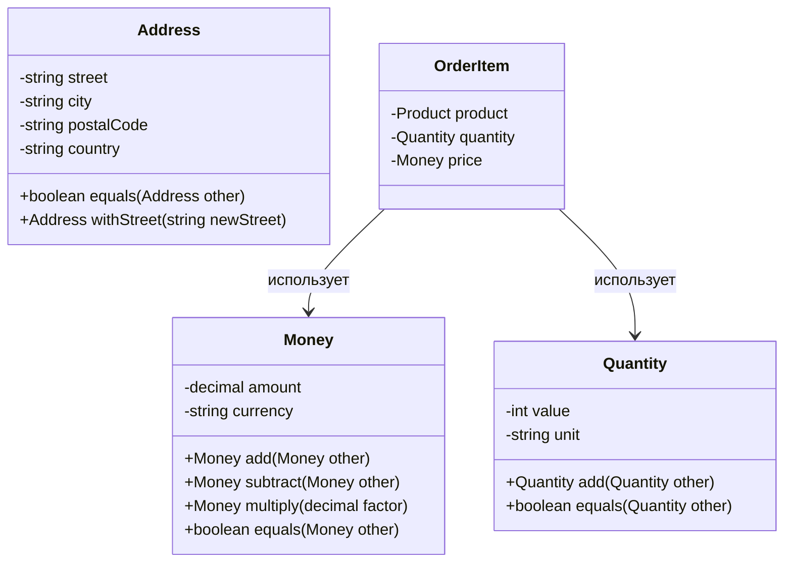

---
# === Основная информация ===
title: "Объект-значение" # H1 страницы и название в навигации
description: "Объект-значение — это объект, который представляет концептуальное целое и идентифицируется только по значению своих атрибутов. Используется для моделирования понятий, которые не имеют уникального идентификатора." # Короткое описание для превью-карточек и SEO

# === Таксономия и Навигация ===
section: "ddd" # Главный раздел (ddd, smells, clean-architecture)
category: "tactical" # Подкатегория (strategic, tactical, etc.)

# === Визуал ===
cover: "/images/patterns/value-object-cover.svg" # Путь к главной иллюстрации

# === Связи (Секретный Соус) ===
related:
  - "entity"
  - "aggregate"
  - "domain-event"
  - "god-object" # Ссылка на "запах", который этот паттерн лечит

# === Метаданные ===
published: true # true/false. Позволяет держать черновики в репозитории
lastUpdated: "2024-05-21"
---

# Объект-значение

### 🤕 Проблема

При моделировании предметной области мы часто сталкиваемся с концепциями, которые не имеют уникальной идентичности и могут быть взаимозаменяемы, если все их атрибуты одинаковы. Например, деньги, адреса, цвета, даты. Представление таких концепций как обычных объектов приводит к нарушению инкапсуляции, проблемам с изменяемостью и сложностям с сравнением объектов.

Как следствие, код становится менее понятным, появляются примитивные одержимости (primitive obsession), где бизнес-концепции представлены простыми типами данных, такими как строки или числа, и теряется смысловая нагрузка.

### 💡 Решение

Объект-значение (Value Object) — это объект, который представляет собой описательную характеристику чего-либо и не имеет уникальной идентичности. Он характеризуется следующими свойствами:

1. **Идентификация по значению**: Два объекта-значения равны, если все их атрибуты равны.
2. **Неизменяемость**: После создания объект-значение не может быть изменен.
3. **Отсутствие побочных эффектов**: Операции над объектами-значениями не меняют их состояние, а создают новые объекты.
4. **Концептуальная целостность**: Объект-значение представляет одно концептуальное целое.

### ⚙️ Структура



### 👨‍💻 Пример в коде

```typescript
// Объект-значение Money
export class Money {
  private readonly _amount: number;
  private readonly _currency: string;

  constructor(amount: number, currency: string) {
    this._amount = amount;
    this._currency = currency;
  }

  public add(other: Money): Money {
    if (this._currency !== other._currency) {
      throw new Error(`Cannot add money with different currencies: ${this._currency} and ${other._currency}`);
    }
    return new Money(this._amount + other._amount, this._currency);
  }

  public subtract(other: Money): Money {
    if (this._currency !== other._currency) {
      throw new Error(`Cannot subtract money with different currencies: ${this._currency} and ${other._currency}`);
    }
    return new Money(this._amount - other._amount, this._currency);
  }

  public multiply(factor: number): Money {
    return new Money(this._amount * factor, this._currency);
  }

  public equals(other: Money): boolean {
    if (other === null || other === undefined) {
      return false;
    }
    return this._amount === other._amount && this._currency === other._currency;
  }

  public isGreaterThan(other: Money): boolean {
    this.ensureSameCurrency(other);
    return this._amount > other._amount;
  }

  public isLessThan(other: Money): boolean {
    this.ensureSameCurrency(other);
    return this._amount < other._amount;
  }

  private ensureSameCurrency(other: Money): void {
    if (this._currency !== other._currency) {
      throw new Error(`Cannot compare money with different currencies: ${this._currency} and ${other._currency}`);
    }
  }

  get amount(): number {
    return this._amount;
  }

  get currency(): string {
    return this._currency;
  }

  public toString(): string {
    return `${this._amount} ${this._currency}`;
  }
}

// Пример использования
const price1 = new Money(100, "USD");
const price2 = new Money(50, "USD");

// Создание нового объекта-значения (неизменяемость)
const totalPrice = price1.add(price2); // 150 USD

// Сравнение объектов-значений
const areEqual = price1.equals(new Money(100, "USD")); // true

// Объект-значение Address
export class Address {
  private readonly _street: string;
  private readonly _city: string;
  private readonly _postalCode: string;
  private readonly _country: string;

  constructor(street: string, city: string, postalCode: string, country: string) {
    this._street = street;
    this._city = city;
    this._postalCode = postalCode;
    this._country = country;
  }

  // Создание нового объекта с измененной улицей (неизменяемость)
  public withStreet(newStreet: string): Address {
    return new Address(newStreet, this._city, this._postalCode, this._country);
  }

  // Проверка равенства
  public equals(other: Address): boolean {
    if (other === null || other === undefined) {
      return false;
    }
    return (
      this._street === other._street &&
      this._city === other._city &&
      this._postalCode === other._postalCode &&
      this._country === other._country
    );
  }

  get street(): string { return this._street; }
  get city(): string { return this._city; }
  get postalCode(): string { return this._postalCode; }
  get country(): string { return this._country; }

  public toString(): string {
    return `${this._street}, ${this._city}, ${this._postalCode}, ${this._country}`;
  }
}
```

### ✅ Когда применять (Чек-лист)

- Когда концепция не имеет уникальной идентичности и может быть полностью заменена другим объектом с теми же значениями
- Когда важно сравнение по значению, а не по ссылке или идентификатору
- Когда объект представляет измерение, количество или описание
- Когда нужно избежать "примитивной одержимости" (primitive obsession)
- Когда объект должен быть неизменяемым и потокобезопасным
- Когда объект используется как атрибут в других объектах домена

### 👍 Плюсы и 👎 Минусы

| Плюсы | Минусы |
|-------|--------|
| Улучшает выразительность и понятность модели | Увеличивает количество классов в системе |
| Повышает безопасность благодаря неизменяемости | Требует более тщательного проектирования |
| Упрощает тестирование благодаря отсутствию побочных эффектов | Может усложнить маппинг в базу данных |
| Уменьшает дублирование кода для проверок валидности | Может снизить производительность из-за создания новых объектов |
| Обеспечивает инкапсуляцию бизнес-правил, связанных с атрибутами | Требует дополнительной работы по сериализации/десериализации |