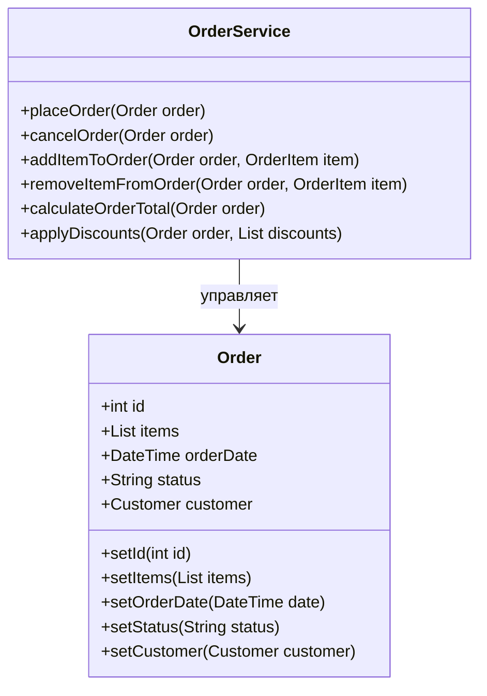

---
# === Основная информация ===
title: "Анемичная модель предметной области" # H1 страницы и название в навигации
description: "Архитектурный запах, при котором классы домена содержат только данные, но не содержат бизнес-логику, превращаясь в простые контейнеры данных." # Короткое описание для превью-карточек и SEO

# === Таксономия и Навигация ===
section: "smells" # Главный раздел (ddd, smells, clean-architecture)
category: "data-centric" # Подкатегория (coupling, data-centric, etc.)
severity: "high" # Критичность запаха (low, medium, high)

# === Визуал ===
cover: "/images/smells/anemic-model-cover.svg" # Путь к главной иллюстрации

# === Связи (Секретный Соус) ===
related:
  - "god-object"
solutions:
  - "aggregate"
  - "entity"
  - "value-object"

# === Метаданные ===
published: true # true/false. Позволяет держать черновики в репозитории
lastUpdated: "2024-05-21"
---

# Анемичная модель предметной области

### 🤕 Проблема

При разработке программного обеспечения мы часто сталкиваемся с ситуацией, когда классы доменной модели превращаются в простые контейнеры данных без какого-либо поведения. Вся бизнес-логика оказывается вынесенной во внешние сервисы, которые манипулируют этими объектами-данными. Это приводит к потере инкапсуляции, нарушению принципов объектно-ориентированного программирования и затрудняет поддержку и развитие системы.

Представьте, что вам нужно добавить новую бизнес-операцию. Вместо того, чтобы просто добавить метод в соответствующий класс домена, вам приходится искать подходящий сервис или создавать новый, а затем обеспечивать корректное взаимодействие этого сервиса с объектами-данными, заботясь о сохранении целостности данных и соблюдении бизнес-правил.

### 💡 Симптомы

Анемичная модель предметной области характеризуется следующими признаками:

1. **Классы домена содержат только поля и свойства**, но почти не содержат методов с бизнес-логикой.
2. **Публичные сеттеры для всех свойств**, что нарушает инкапсуляцию и делает объекты изменяемыми из любой точки программы.
3. **Сервисные классы с префиксами Manager, Service, Handler**, которые содержат всю бизнес-логику и манипулируют объектами домена.
4. **Нарушение инвариантов и правил домена** из-за отсутствия централизованного контроля за изменениями объектов.
5. **Сложность в понимании кода**, так как логика размазана по множеству сервисов вместо того, чтобы быть сгруппированной вокруг соответствующих объектов домена.

### ⚙️ Пример анемичной модели



### 👨‍💻 Примеры в коде

#### Пример анемичной модели

```typescript
// Анемичная модель: просто контейнер данных
class Order {
    public id: number;
    public items: OrderItem[] = [];
    public orderDate: Date;
    public status: string;
    public customerId: number;
    public totalAmount: number;
}

class OrderItem {
    public id: number;
    public orderId: number;
    public productId: number;
    public quantity: number;
    public unitPrice: number;
}

// Сервис, содержащий всю бизнес-логику
class OrderService {
    public placeOrder(order: Order, customerId: number): void {
        order.customerId = customerId;
        order.orderDate = new Date();
        order.status = "New";
        order.totalAmount = this.calculateTotal(order);
        // Сохранение в БД...
    }
    
    public addItemToOrder(order: Order, productId: number, quantity: number, price: number): void {
        // Проверка, существует ли заказ
        if (order.status === "Cancelled" || order.status === "Completed") {
            throw new Error("Cannot modify a completed or cancelled order");
        }
        
        const item = new OrderItem();
        item.orderId = order.id;
        item.productId = productId;
        item.quantity = quantity;
        item.unitPrice = price;
        
        order.items.push(item);
        order.totalAmount = this.calculateTotal(order);
        // Сохранение в БД...
    }
    
    public cancelOrder(order: Order): void {
        if (order.status === "Completed") {
            throw new Error("Cannot cancel a completed order");
        }
        
        order.status = "Cancelled";
        // Сохранение в БД...
    }
    
    private calculateTotal(order: Order): number {
        return order.items.reduce((sum, item) => sum + (item.quantity * item.unitPrice), 0);
    }
}
```

#### Богатая доменная модель (решение)

```typescript
// Богатая доменная модель с бизнес-логикой
class Order {
    private _id: number;
    private _items: OrderItem[] = [];
    private _orderDate: Date;
    private _status: OrderStatus;
    private _customerId: number;
    
    constructor(customerId: number) {
        this._customerId = customerId;
        this._orderDate = new Date();
        this._status = OrderStatus.New;
    }
    
    public addItem(productId: number, quantity: number, price: number): void {
        if (this._status === OrderStatus.Cancelled || this._status === OrderStatus.Completed) {
            throw new Error("Cannot modify a completed or cancelled order");
        }
        
        const existingItem = this._items.find(i => i.productId === productId);
        
        if (existingItem) {
            existingItem.increaseQuantity(quantity);
        } else {
            const newItem = new OrderItem(this._id, productId, quantity, price);
            this._items.push(newItem);
        }
    }
    
    public removeItem(productId: number): void {
        if (this._status === OrderStatus.Cancelled || this._status === OrderStatus.Completed) {
            throw new Error("Cannot modify a completed or cancelled order");
        }
        
        const index = this._items.findIndex(i => i.productId === productId);
        if (index >= 0) {
            this._items.splice(index, 1);
        }
    }
    
    public cancel(): void {
        if (this._status === OrderStatus.Completed) {
            throw new Error("Cannot cancel a completed order");
        }
        
        this._status = OrderStatus.Cancelled;
    }
    
    public complete(): void {
        if (this._status === OrderStatus.Cancelled) {
            throw new Error("Cannot complete a cancelled order");
        }
        
        if (this._items.length === 0) {
            throw new Error("Cannot complete an empty order");
        }
        
        this._status = OrderStatus.Completed;
    }
    
    public calculateTotal(): number {
        return this._items.reduce((sum, item) => sum + item.calculateSubtotal(), 0);
    }
    
    // Только геттеры, без сеттеров для обеспечения инкапсуляции
    get id(): number { return this._id; }
    get items(): ReadonlyArray<OrderItem> { return [...this._items]; }
    get orderDate(): Date { return new Date(this._orderDate.getTime()); }
    get status(): OrderStatus { return this._status; }
    get customerId(): number { return this._customerId; }
}

enum OrderStatus {
    New = 'New',
    Processing = 'Processing',
    Completed = 'Completed',
    Cancelled = 'Cancelled'
}

class OrderItem {
    private _orderId: number;
    private _productId: number;
    private _quantity: number;
    private _unitPrice: number;
    
    constructor(orderId: number, productId: number, quantity: number, unitPrice: number) {
        this._orderId = orderId;
        this._productId = productId;
        this._quantity = quantity;
        this._unitPrice = unitPrice;
    }
    
    public increaseQuantity(quantity: number): void {
        if (quantity <= 0) {
            throw new Error("Quantity must be positive");
        }
        this._quantity += quantity;
    }
    
    public decreaseQuantity(quantity: number): void {
        if (quantity <= 0) {
            throw new Error("Quantity must be positive");
        }
        
        if (this._quantity - quantity < 0) {
            throw new Error("Cannot decrease quantity below zero");
        }
        
        this._quantity -= quantity;
    }
    
    public calculateSubtotal(): number {
        return this._quantity * this._unitPrice;
    }
    
    get productId(): number { return this._productId; }
    get quantity(): number { return this._quantity; }
    get unitPrice(): number { return this._unitPrice; }
}
```

### ✅ Как исправить (Чек-лист)

1. **Переместите бизнес-логику в объекты домена**:
   - Определите, какие операции и правила относятся к каждому объекту
   - Реализуйте эти операции как методы соответствующих классов

2. **Обеспечьте инкапсуляцию**:
   - Сделайте поля приватными
   - Предоставьте только необходимые геттеры
   - Избегайте публичных сеттеров
   - Проверяйте входные данные и соблюдайте бизнес-правила в методах

3. **Применяйте паттерны DDD**:
   - Используйте [Агрегаты](/ddd/tactical/aggregate) для определения границ согласованности
   - Применяйте [Объекты-значения](/ddd/tactical/value-object) для моделирования атрибутов
   - Определите четкие [Сущности](/ddd/tactical/entity) с идентичностью
   - Используйте [Репозитории](/ddd/tactical/repository) для абстракции доступа к данным

4. **Используйте принцип "Tell, Don't Ask"**:
   - Вместо запроса данных у объекта и выполнения операций над ними, указывайте объекту, что нужно сделать

5. **Применяйте тесты для проверки поведения**:
   - Убедитесь, что ваша модель правильно реализует бизнес-правила
   - Проверьте, что состояние объектов всегда согласовано

### 👍 Плюсы и 👎 Минусы богатой доменной модели

| Плюсы | Минусы |
|-------|--------|
| Улучшение инкапсуляции бизнес-правил | Увеличение сложности доменных классов |
| Повышение согласованности данных | Требует более глубокого понимания предметной области |
| Улучшение читаемости и понятности кода | Может усложнить сериализацию/десериализацию |
| Снижение дублирования кода | Требует тщательного проектирования |
| Упрощение тестирования бизнес-логики | Может требовать больше времени на начальное развитие |